# UltraQuant — Architecture

**Version 4.4 · 1168 tests green · pure-Python core with optional C++/CUDA acceleration**

UltraQuant is an ultra-quantized (ternary-weight) hybrid quantum/classical pattern
model with a catalogued, pageable shard library and an interactive interpreter.
Everything in the core is written from scratch against the Python standard library
— the qubit engine, the neural network, the memory, the archive. Native
acceleration and a real QPU are strictly *optional accelerants*: the pure-Python
tier defines the semantics, and every other tier is verified to reproduce it to
1e-9.

- [0. Quick start](#0-quick-start)
- [1. Design principles](#1-design-principles)
- [2. System overview](#2-system-overview)
- [3. Subsystems (class diagrams)](#3-subsystems)
- [4. Runtime behaviour (sequence diagrams)](#4-runtime-behaviour)
- [5. Lifecycles (state diagrams)](#5-lifecycles)
- [6. Execution tiers and measured performance](#6-execution-tiers-and-measured-performance)
- [7. The quantum reality check](#7-the-quantum-reality-check)
- [7.1 What a QPU could actually do for a shard library](#71-what-a-qpu-could-actually-do-for-a-shard-library)
- [8. File formats](#8-file-formats)
- [9. Testing](#9-testing)
- [10. Limitations and roadmap](#10-limitations-and-roadmap)
- [11. The distance to general](#11-the-distance-to-general)
- [11.5 Stage 1 was run, and it failed](#115-stage-1-was-run-and-it-failed)
- [11.6 Stage 2 was run, and it passed](#116-stage-2-was-run-and-it-passed)
- [11.7 Hypervectors: half a pass](#117-hypervectors-half-a-pass)
- [11.8 Stage 3 was run, and it passed](#118-stage-3-was-run-and-it-passed)
- [11.9 Stage 4 was run, and it passed](#119-stage-4-was-run-and-it-passed)
- [11.10 Stage 5 was run, and it passed](#1110-stage-5-was-run-and-it-passed)

---

## 0. Quick start

**Double-click `UltraQuant.bat`.** That is the whole installation: no packages to
install, no environment to activate. It finds Python, checks Tkinter is present,
and opens the desktop app — falling back to a plain terminal message with
instructions if either is missing.

| Tab | What it does |
|-----|--------------|
| **Chat** | The thought pipeline, colon-commands, and the trace of the last turn beside it |
| **Forge** | Build a model from scratch — invent categories, pick a tier, watch it train |
| **Library** | The shard catalog, what is resident, and the RAM budget (change it live) |
| **Stash** | Triage web claims: promote what is corroborated, reject the rest |
| **Learn** | The model finds its own knowledge gaps and asks you about them |
| **Compute** | Pick CPU / GPU / both, thread count, quantum tier, RAM slider |
| **Storage** | Backend picker (NVMe-oF, Ceph, SAN…), RAM tier, array snapshots |
| **Benchmark** | Measure the execution tiers on this machine |

The title bar strip shows which accelerators were detected (e.g. `CUDA: NVIDIA
GeForce RTX 4090 | C++ | forge-GPU | QPU: none`).

Everything is also reachable from a terminal:

```bash
python -m ultraquant.gui                       # the same desktop app
python -m ultraquant.tui                       # the same surfaces in a terminal
python -m ultraquant.interpreter.chat          # terminal chat
python -m ultraquant.forge.build --synthetic 64 --compare
python -m ultraquant.bench
python -m unittest discover -s tests
```

PowerShell users can use `.\ultraquant.ps1 -Mode forge -Rest '--synthetic','128'`
instead of remembering module paths.

**Linux and macOS.** `./ultraquant.sh` is the equivalent launcher: it opens the
desktop app when Tkinter is present and the terminal UI when it is not, which is
the usual case on a headless box. `native/build.sh` builds the accelerators as
`.so` / `.dylib`.

The native loaders now resolve the library name per platform. They were
hardcoded to `.dll`, so the accelerators could never load anywhere but Windows
-- and the failure was silent, because the pure-Python tier simply took over and
the only symptom was that everything ran slower.

**The terminal UI is deliberately not curses.** `curses` ships with CPython on
Linux and macOS and *not* on Windows, so a curses interface would have run on
exactly the platforms that already had the desktop app and failed on the one that
did not. `ultraquant/tui.py` renders with plain writes and optional ANSI, so it
works on a Windows console, an xterm, a serial console, a CI log and a pipe. Each
screen is a function from a command to text, which is why the whole interface is
tested with no terminal attached.

**Optional native tiers.** The C++ and CUDA accelerators are prebuilt into
`ultraquant/native/_bin/`. To rebuild them (needs Visual Studio C++ tools, and
the CUDA toolkit for the GPU targets):

```bash
powershell -ExecutionPolicy Bypass -File native\build.ps1 -Target all
```

Without them, everything still runs on the pure-Python tier — slower, identical
results.

---

## 1. Design principles

| # | Principle | Consequence |
|---|-----------|-------------|
| 1 | **The simulator is the reference** | Exact statevector maths defines correct behaviour. QPU and GPU are accelerants, never semantics. This is *why* the classical path loses nothing. |
| 2 | **Never load what you don't need** | Model data is sharded, catalogued and paged. Store size is bounded by disk, not RAM. |
| 3 | **Recall reinforces** | Every access bumps counts and association weights, so the catalog reorganises around what is actually used. |
| 4 | **Found ≠ believed** | Web content is quarantined and analysed before it can become fact. Corroboration promotes; opinion does not. |
| 5 | **Refuse by default** | The code sandbox whitelists; the network is gated off; the archive verifies digests. |
| 6 | **Degrade, never fail** | Missing DLL, missing GPU, missing qiskit, missing network — each falls back a tier and keeps working. |

---

## 2. System overview

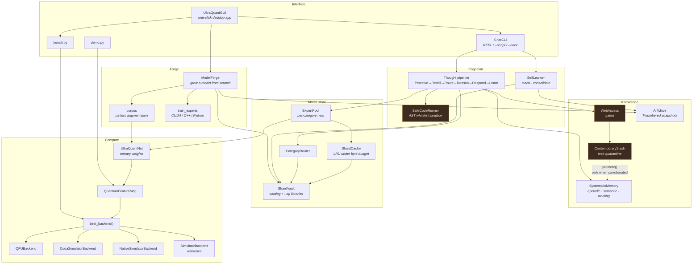
```mermaid
graph TB
    subgraph Interface
        GUI["UltraQuantGUI<br/><i>one-click desktop app</i>"]
        CHAT["ChatCLI<br/><i>REPL / --script / --once</i>"]
        DEMO["demo.py"]
        BENCH["bench.py"]
    end

    subgraph Cognition
        THOUGHTS["Thought pipeline<br/>Perceive→Recall→Route→Reason→Respond→Learn"]
        SELF["SelfLearner<br/><i>teach · consolidate</i>"]
        CODE["SafeCodeRunner<br/><i>AST whitelist sandbox</i>"]
    end

    subgraph Knowledge
        MEM["SystematicMemory<br/><i>episodic · semantic · working</i>"]
        STASH["ContemporaryStash<br/><i>web quarantine</i>"]
        WEB["WebAccess<br/><i>gated</i>"]
        ARCH["ArTchive<br/><i>T-numbered snapshots</i>"]
    end

    subgraph "Model store"
        ROUTER["CategoryRouter"]
        VAULT["ShardVault<br/><i>catalog + .uql libraries</i>"]
        CACHE["ShardCache<br/><i>LRU under byte budget</i>"]
        EXPERTS["ExpertPool<br/><i>per-category nets</i>"]
    end

    subgraph Forge
        FORGE["ModelForge<br/><i>grow a model from scratch</i>"]
        CORPUS["corpus<br/><i>pattern augmentation</i>"]
        TRAIN["train_experts<br/><i>CUDA / C++ / Python</i>"]
    end

    subgraph "Compute"
        NET["UltraQuantNet<br/><i>ternary weights</i>"]
        QMAP["QuantumFeatureMap"]
        DISPATCH["best_backend()"]
        QPU["QPUBackend"]
        CUDA["CudaSimulatorBackend"]
        NCPU["NativeSimulatorBackend"]
        SIM["SimulatorBackend<br/><i>reference</i>"]
    end

    FORGE --> CORPUS
    FORGE --> TRAIN
    FORGE --> VAULT
    FORGE --> ARCH
    CORPUS --> NET
    GUI --> CHAT
    GUI --> FORGE
    GUI --> BENCH
    CHAT --> THOUGHTS
    CHAT --> SELF
    DEMO --> QMAP
    BENCH --> DISPATCH
    THOUGHTS --> MEM
    THOUGHTS --> CODE
    THOUGHTS --> WEB
    THOUGHTS --> ROUTER
    THOUGHTS --> EXPERTS
    WEB --> STASH
    STASH -.->|"promote()<br/>only when corroborated"| MEM
    SELF --> VAULT
    SELF --> ARCH
    ROUTER --> VAULT
    EXPERTS --> CACHE
    EXPERTS --> NET
    CACHE --> VAULT
    NET --> QMAP
    QMAP --> DISPATCH
    DISPATCH --> QPU
    DISPATCH --> CUDA
    DISPATCH --> NCPU
    DISPATCH --> SIM

    classDef gate fill:#3d2b1f,stroke:#c98a3a,color:#f5e6d3
    class STASH,CODE,WEB gate
```

The dashed edge is the only path from the network into stored knowledge, and it
is guarded — see [§5.2](#52-stash-entry-lifecycle).

### Package layout

```
ultraquant/
  quantum/     gates · state · circuit · backend · qlayer      from-scratch qubit engine
               ansatz · vqc · kernel · noise · search ·        trainable circuits, kernels,
               analysis · encodings · benchmark_kernels ·      mitigation, Grover, cloud,
               bluequbit                                       the hard-map experiment
  model/       quantize · network                              ternary weights, STE training
  memory/      systematic                                      episodic / semantic / working
  archive/     artchive                                        tamper-evident T-snapshots
  pattern/     recognition                                     glyph dataset + recognizer
  reason/      blackboard                                     where partial results meet
  shards/      vault · budget · router · sketch · scale_demo   the pageable library
  experts/     moe                                             per-category experts
  forge/       corpus · trainer · forge · build                grow a model from scratch
  hybrid/      expert · pool                                  quantum vs classical experts
  storage/     base · local · blockdev · ceph · ram ·          pluggable byte-range storage
               tiered · index · registry · vendors · scale
  interpreter/ codefunc · webaccess · stash · thoughts ·       the chat layer
               selflearn · learning · chat                     (learning = it asks you)
  native/      accel · backends · hetero · dispatch · _bin/    C++/CUDA tiers
  gui.py  demo.py  bench.py
native/        uq_core.cpp · uq_cuda.cu · uq_forge.cpp ·        compiled sources
               uq_forge.cu · build.ps1
tests/         57 modules, 1168 tests
```

---

## 3. Subsystems

### 3.1 Quantum engine

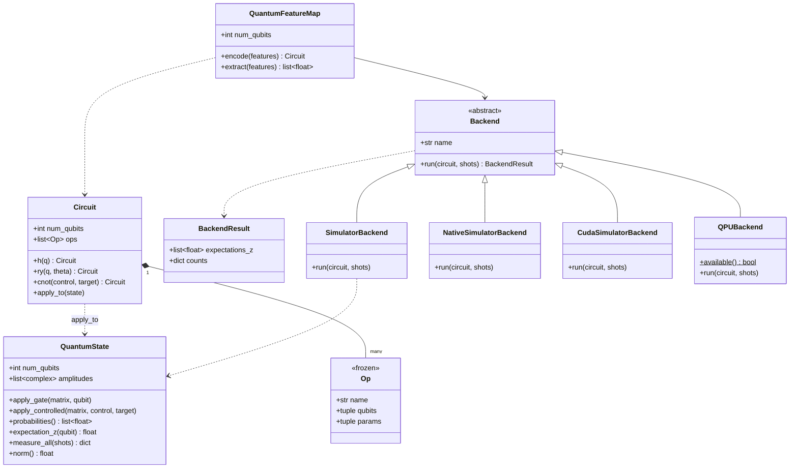
```mermaid
classDiagram
    class QuantumState {
        +int num_qubits
        +list~complex~ amplitudes
        +apply_gate(matrix, qubit)
        +apply_controlled(matrix, control, target)
        +probabilities() list~float~
        +expectation_z(qubit) float
        +measure_all(shots) dict
        +norm() float
    }
    class Circuit {
        +int num_qubits
        +list~Op~ ops
        +h(q) Circuit
        +ry(q, theta) Circuit
        +cnot(control, target) Circuit
        +apply_to(state)
    }
    class Op {
        <<frozen>>
        +str name
        +tuple qubits
        +tuple params
    }
    class Backend {
        <<abstract>>
        +str name
        +run(circuit, shots) BackendResult
    }
    class BackendResult {
        +list~float~ expectations_z
        +dict counts
    }
    class SimulatorBackend {
        +run(circuit, shots)
    }
    class NativeSimulatorBackend {
        +run(circuit, shots)
    }
    class CudaSimulatorBackend {
        +run(circuit, shots)
    }
    class QPUBackend {
        +available()$ bool
        +run(circuit, shots)
    }
    class QuantumFeatureMap {
        +int num_qubits
        +encode(features) Circuit
        +extract(features) list~float~
    }

    Circuit "1" *-- "many" Op
    Circuit ..> QuantumState : apply_to
    Backend <|-- SimulatorBackend
    Backend <|-- NativeSimulatorBackend
    Backend <|-- CudaSimulatorBackend
    Backend <|-- QPUBackend
    Backend ..> BackendResult
    SimulatorBackend ..> QuantumState
    QuantumFeatureMap --> Backend
    QuantumFeatureMap ..> Circuit
```

**Conventions.** Little-endian: qubit *q* is bit *q* of the basis index, and
`measure_all` returns bitstrings with qubit 0 rightmost. Amplitudes are dense
`complex`; a 2-qubit `X` on qubit 0 puts amplitude 1 at index 1 and yields the
key `"01"`. Every native tier reproduces this exactly.

**Feature map.** `theta_i = pi * tanh(f_i)` (bounded, so extreme features can't
wrap the rotation), an RY layer, a ring of CNOTs, then *data re-uploading* —
repeat the layer with the next chunk until features are exhausted. Output is one
`<Z>` per qubit in [-1, 1].

### 3.2 Ultra-quantized model

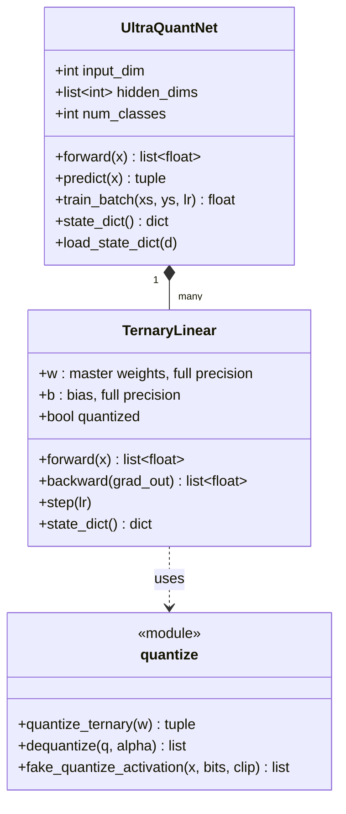
```mermaid
classDiagram
    class TernaryLinear {
        +w : master weights, full precision
        +b : bias, full precision
        +bool quantized
        +forward(x) list~float~
        +backward(grad_out) list~float~
        +step(lr)
        +state_dict() dict
    }
    class UltraQuantNet {
        +int input_dim
        +list~int~ hidden_dims
        +int num_classes
        +forward(x) list~float~
        +predict(x) tuple
        +train_batch(xs, ys, lr) float
        +state_dict() dict
        +load_state_dict(d)
    }
    class quantize {
        <<module>>
        +quantize_ternary(w) tuple
        +dequantize(q, alpha) list
        +fake_quantize_activation(x, bits, clip) list
    }
    UltraQuantNet "1" *-- "many" TernaryLinear
    TernaryLinear ..> quantize : uses
```

Weights are ternary `{-1, 0, +1}` with one fp32 scale α per layer:
`δ = 0.75 · mean|w|`, `q = sign(w)·[|w| > δ]`, `α = mean(|w|)` over non-zeros.
Training keeps full-precision *master* weights and uses a **straight-through
estimator** — the forward pass uses quantized weights, and their gradient passes
straight through to the master copy, which is then clamped to [-1, 1].
Activations are fake-quantized to 8 bits over [-4, 4].

### 3.3 The shard library — brain-like cataloguing

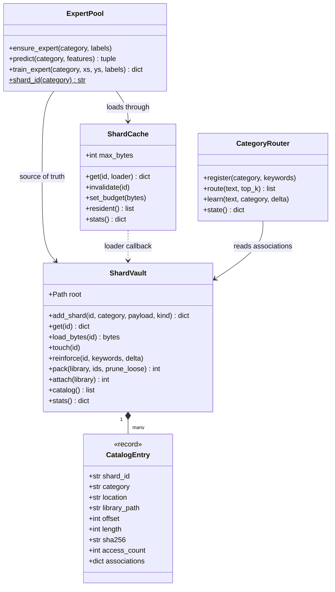
```mermaid
classDiagram
    class ShardVault {
        +Path root
        +add_shard(id, category, payload, kind) dict
        +get(id) dict
        +load_bytes(id) bytes
        +touch(id)
        +reinforce(id, keywords, delta)
        +pack(library, ids, prune_loose) int
        +attach(library) int
        +catalog() list
        +stats() dict
    }
    class CatalogEntry {
        <<record>>
        +str shard_id
        +str category
        +str location
        +str library_path
        +int offset
        +int length
        +str sha256
        +int access_count
        +dict associations
    }
    class ShardCache {
        +int max_bytes
        +get(id, loader) dict
        +invalidate(id)
        +set_budget(bytes)
        +resident() list
        +stats() dict
    }
    class CategoryRouter {
        +register(category, keywords)
        +route(text, top_k) list
        +learn(text, category, delta)
        +state() dict
    }
    class ExpertPool {
        +ensure_expert(category, labels)
        +predict(category, features) tuple
        +train_expert(category, xs, ys, labels) dict
        +shard_id(category)$ str
    }

    ShardVault "1" *-- "many" CatalogEntry
    ExpertPool --> ShardCache : loads through
    ExpertPool --> ShardVault : source of truth
    ShardCache ..> ShardVault : loader callback
    CategoryRouter --> ShardVault : reads associations
```

Three ideas make this brain-like rather than merely a cache:

1. **Association weights.** Each shard carries `associations: {keyword: strength}`,
   strengthened on every use (capped at 5.0). Routing scores a category by base
   keywords *plus* the accumulated associations of its shards, so the store
   reorganises around actual usage.
2. **Reinforcement survives retraining.** Re-adding a shard overwrites the bytes
   but preserves `access_count` and `associations` — relearning a skill doesn't
   erase that you use it.
3. **Consolidation.** Shards recalled at least twice get packed out of loose
   files into a library container and the state is snapshotted — scattered recent
   learning becomes one compact, verifiable layer.

### 3.4 The forge — creating a model from scratch

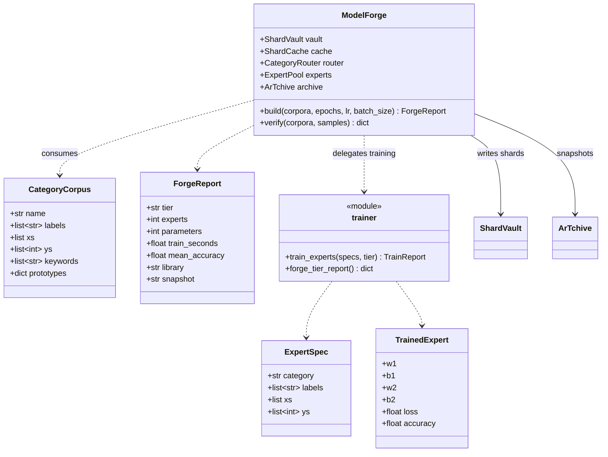
```mermaid
classDiagram
    class ModelForge {
        +ShardVault vault
        +ShardCache cache
        +CategoryRouter router
        +ExpertPool experts
        +ArTchive archive
        +build(corpora, epochs, lr, batch_size) ForgeReport
        +verify(corpora, samples) dict
    }
    class CategoryCorpus {
        +str name
        +list~str~ labels
        +list xs
        +list~int~ ys
        +list~str~ keywords
        +dict prototypes
    }
    class ExpertSpec {
        +str category
        +list~str~ labels
        +list xs
        +list~int~ ys
    }
    class TrainedExpert {
        +w1
        +b1
        +w2
        +b2
        +float loss
        +float accuracy
    }
    class ForgeReport {
        +str tier
        +int experts
        +int parameters
        +float train_seconds
        +float mean_accuracy
        +str library
        +str snapshot
    }
    class trainer {
        <<module>>
        +train_experts(specs, tier) TrainReport
        +forge_tier_report() dict
    }

    ModelForge ..> CategoryCorpus : consumes
    ModelForge ..> trainer : delegates training
    trainer ..> ExpertSpec
    trainer ..> TrainedExpert
    ModelForge ..> ForgeReport
    ModelForge --> ShardVault : writes shards
    ModelForge --> ArTchive : snapshots
```

A model here is not one big tensor — it is a **library of pattern experts**, one
per category, each a ternary network stored as its own shard.  That is what makes
the forge and the paging store two halves of one idea: the thing you build is
already the thing you can page.

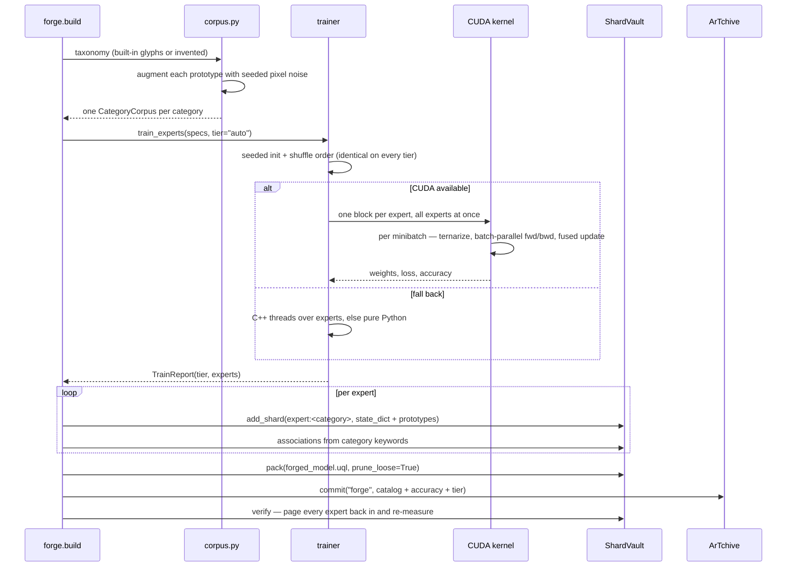
```mermaid
sequenceDiagram
    participant CLI as forge.build
    participant Corpus as corpus.py
    participant T as trainer
    participant GPU as CUDA kernel
    participant Vault as ShardVault
    participant Arch as ArTchive

    CLI->>Corpus: taxonomy (built-in glyphs or invented)
    Corpus->>Corpus: augment each prototype with seeded pixel noise
    Corpus-->>CLI: one CategoryCorpus per category
    CLI->>T: train_experts(specs, tier="auto")
    T->>T: seeded init + shuffle order (identical on every tier)
    alt CUDA available
        T->>GPU: one block per expert, all experts at once
        GPU->>GPU: per minibatch — ternarize, batch-parallel fwd/bwd, fused update
        GPU-->>T: weights, loss, accuracy
    else fall back
        T->>T: C++ threads over experts, else pure Python
    end
    T-->>CLI: TrainReport(tier, experts)
    loop per expert
        CLI->>Vault: add_shard(expert:<category>, state_dict + prototypes)
        CLI->>Vault: associations from category keywords
    end
    CLI->>Vault: pack(forged_model.uql, prune_loose=True)
    CLI->>Arch: commit("forge", catalog + accuracy + tier)
    CLI->>Vault: verify — page every expert back in and re-measure
```

The verification step matters: it re-measures accuracy by pulling each expert
*back out of the packed library* through the normal serving path (catalog lookup,
byte-range read, digest check, cache admission), so the number reported describes
the model on disk rather than the weights that happened to be in memory.

### 3.5 Interpreter

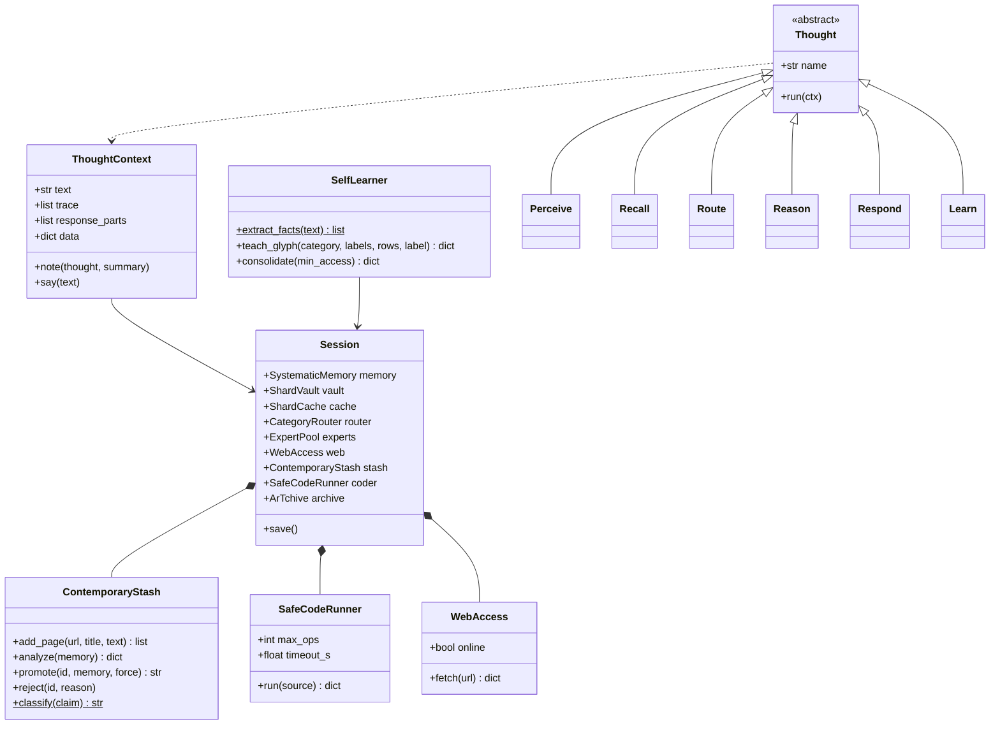
```mermaid
classDiagram
    class Session {
        +SystematicMemory memory
        +ShardVault vault
        +ShardCache cache
        +CategoryRouter router
        +ExpertPool experts
        +WebAccess web
        +ContemporaryStash stash
        +SafeCodeRunner coder
        +ArTchive archive
        +save()
    }
    class ThoughtContext {
        +str text
        +list trace
        +list response_parts
        +dict data
        +note(thought, summary)
        +say(text)
    }
    class Thought {
        <<abstract>>
        +str name
        +run(ctx)
    }
    class ContemporaryStash {
        +add_page(url, title, text) list
        +analyze(memory) dict
        +promote(id, memory, force) str
        +reject(id, reason)
        +classify(claim)$ str
    }
    class SafeCodeRunner {
        +int max_ops
        +float timeout_s
        +run(source) dict
    }
    class WebAccess {
        +bool online
        +fetch(url) dict
    }
    class SelfLearner {
        +extract_facts(text)$ list
        +teach_glyph(category, labels, rows, label) dict
        +consolidate(min_access) dict
    }

    Thought <|-- Perceive
    Thought <|-- Recall
    Thought <|-- Route
    Thought <|-- Reason
    Thought <|-- Respond
    Thought <|-- Learn
    Thought ..> ThoughtContext
    ThoughtContext --> Session
    Session *-- ContemporaryStash
    Session *-- SafeCodeRunner
    Session *-- WebAccess
    SelfLearner --> Session
```

---

### 3.6 Storage: where the library actually lives

The vault rests on one primitive — *read `length` bytes at `offset`* — so any
medium that can serve that can back the model.

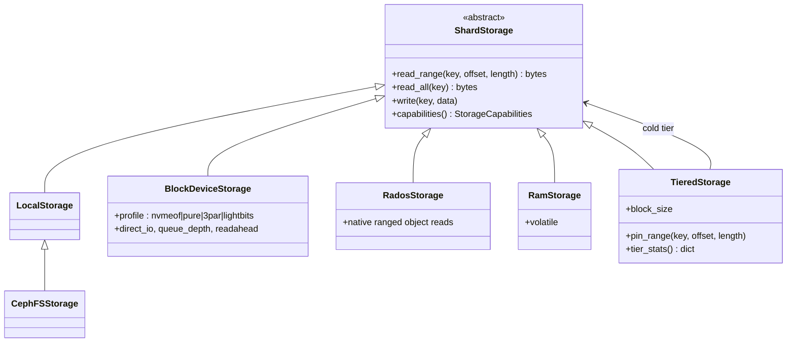
```mermaid
classDiagram
    class ShardStorage {
        <<abstract>>
        +read_range(key, offset, length) bytes
        +read_all(key) bytes
        +write(key, data)
        +capabilities() StorageCapabilities
    }
    class LocalStorage
    class BlockDeviceStorage {
        +profile : nvmeof|pure|3par|lightbits
        +direct_io, queue_depth, readahead
    }
    class CephFSStorage
    class RadosStorage {
        +native ranged object reads
    }
    class RamStorage {
        +volatile
    }
    class TieredStorage {
        +block_size
        +pin_range(key, offset, length)
        +tier_stats() dict
    }
    ShardStorage <|-- LocalStorage
    ShardStorage <|-- BlockDeviceStorage
    ShardStorage <|-- RamStorage
    ShardStorage <|-- RadosStorage
    LocalStorage <|-- CephFSStorage
    ShardStorage <|-- TieredStorage
    TieredStorage --> ShardStorage : cold tier
```

Pure Storage, 3PAR, NVMe-oF and Lightbits are **one parameterised backend**, not
four classes: from the host they are all block devices, and what differs is
host-side tuning (unbuffered aligned I/O, queue depth, readahead). What is
genuinely vendor-specific is the *control plane* — provisioning and snapshots —
which lives in `storage/vendors.py` and is exercised against mocked endpoints,
never a real array.

**RAM is a tier, never the home.** `TieredStorage` caches *blocks*, so reading
one shard out of a packed library brings in only the blocks it spans; an early
version cached whole objects and would have pulled an entire multi-hundred-
gigabyte library into memory on first touch.

**The index is paged too.** At 1.2 M shards a catalog held as Python objects is
gigabytes — the machine would exhaust memory *describing* a model it never
loaded. `storage/index.py` stores a sorted fixed-width table read by byte range,
with only a sparse fence array resident:

| model | library on storage | index on storage | **index resident** |
|---|---:|---:|---:|
| 7 B | 1.3 GB | 916 KB | **680 B** |
| 175 B | 32.6 GB | 22.4 MB | **4.5 KB** |
| 1.2 T | 223.5 GB | 153.4 MB | **28 KB** |

Measured on a real 200 000-record index: 5.1 KB resident, 9 byte-range reads per
lookup, 11.3 µs. RAM cost is set by the fence stride and the working set, not by
the parameter count.

### 3.7 Hybrid experts: quantum where it measurably helps

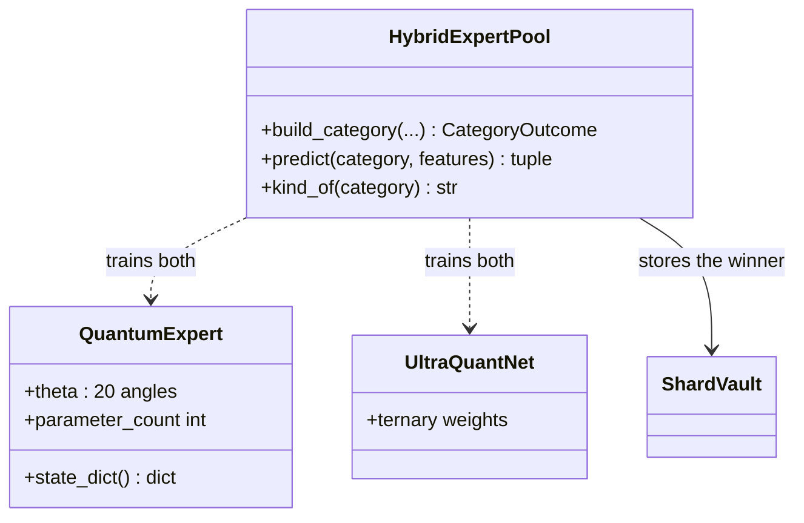
```mermaid
classDiagram
    class HybridExpertPool {
        +build_category(...) CategoryOutcome
        +predict(category, features) tuple
        +kind_of(category) str
    }
    class QuantumExpert {
        +theta : 20 angles
        +state_dict() dict
        +parameter_count int
    }
    class UltraQuantNet {
        +ternary weights
    }
    HybridExpertPool ..> QuantumExpert : trains both
    HybridExpertPool ..> UltraQuantNet : trains both
    HybridExpertPool --> ShardVault : stores the winner
```

Both kinds are trained per category, scored on the same held-out split, and the
winner is kept under a stated rule. Neither wins everywhere — see §6.3.

---

## 4. Runtime behaviour

### 4.1 A chat turn — the predefined set of thought

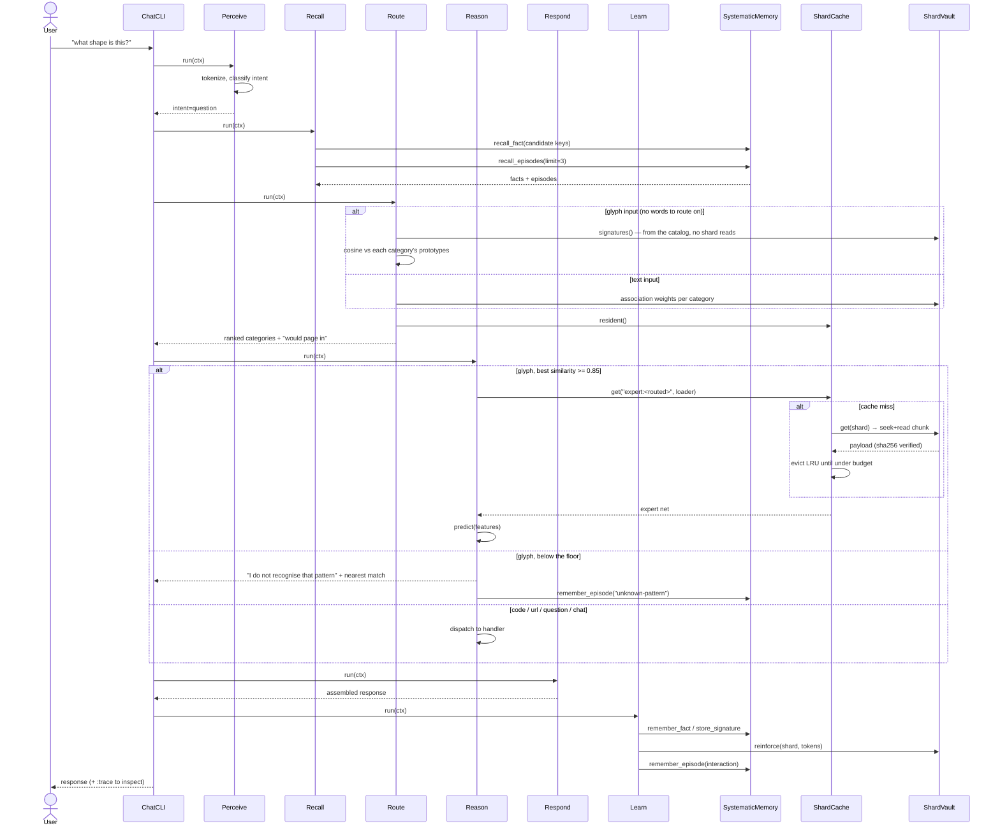
```mermaid
sequenceDiagram
    actor User
    participant CLI as ChatCLI
    participant P as Perceive
    participant R as Recall
    participant RT as Route
    participant RS as Reason
    participant RP as Respond
    participant L as Learn
    participant Mem as SystematicMemory
    participant Cache as ShardCache
    participant Vault as ShardVault

    User->>CLI: "what shape is this?"
    CLI->>P: run(ctx)
    P->>P: tokenize, classify intent
    P-->>CLI: intent=question
    CLI->>R: run(ctx)
    R->>Mem: recall_fact(candidate keys)
    R->>Mem: recall_episodes(limit=3)
    Mem-->>R: facts + episodes
    CLI->>RT: run(ctx)
    alt glyph input (no words to route on)
        RT->>Vault: signatures() — from the catalog, no shard reads
        RT->>RT: cosine vs each category's prototypes
    else text input
        RT->>Vault: association weights per category
    end
    RT->>Cache: resident()
    RT-->>CLI: ranked categories + "would page in"
    CLI->>RS: run(ctx)
    alt glyph, best similarity >= 0.85
        RS->>Cache: get("expert:<routed>", loader)
        alt cache miss
            Cache->>Vault: get(shard) → seek+read chunk
            Vault-->>Cache: payload (sha256 verified)
            Cache->>Cache: evict LRU until under budget
        end
        Cache-->>RS: expert net
        RS->>RS: predict(features)
    else glyph, below the floor
        RS-->>CLI: "I do not recognise that pattern" + nearest match
        RS->>Mem: remember_episode("unknown-pattern")
    else code / url / question / chat
        RS->>RS: dispatch to handler
    end
    CLI->>RP: run(ctx)
    RP-->>CLI: assembled response
    CLI->>L: run(ctx)
    L->>Mem: remember_fact / store_signature
    L->>Vault: reinforce(shard, tokens)
    L->>Mem: remember_episode(interaction)
    CLI-->>User: response (+ :trace to inspect)
```

### 4.1.1 Routing a pattern that contains no words

Keyword routing is the natural way to pick a category, and it is useless for an
image. A glyph has no tokens, so keyword overlap scores zero everywhere and every
pattern falls through to the same default category — where a freshly invented,
untrained expert answers instead of the library. **Every unit test passed while
end-to-end recognition was 0/8.** `tests/test_chat_library.py` exists because of
that, and it is the reason the integration test is not optional.

The fix is to route on *content*. Each expert shard carries a `signature` in the
catalog — the pixel prototypes its category was trained on — and
`CategoryRouter.route_pattern` scores categories by cosine similarity against
them. Two properties matter:

- **Signatures live in the catalog, not the shards.** Routing therefore reads
  nothing from storage; `test_routing_reads_no_shards` asserts the cache miss
  count is unchanged across a routing call. Deciding *which* shard to page in
  must not itself page shards in.
- **A category is as close as its nearest prototype, not its mean.** Mean-pooling
  `plus` and `cross` into one "crosses" vector put the average nearer `arrows`
  than either member was: 7/8 with means, **8/8 per-prototype**.

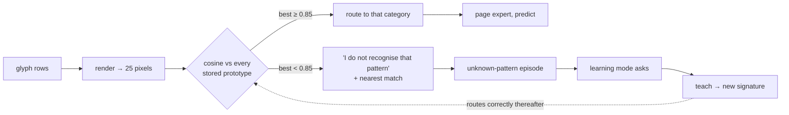
```mermaid
flowchart LR
    G["glyph rows"] --> V["render → 25 pixels"]
    V --> S{"cosine vs every\nstored prototype"}
    S -->|"best ≥ 0.85"| C["route to that category"]
    C --> E["page expert, predict"]
    S -->|"best < 0.85"| U["'I do not recognise that pattern'\n+ nearest match"]
    U --> Q["unknown-pattern episode"]
    Q --> L["learning mode asks"]
    L --> T["teach → new signature"]
    T -.->|"routes correctly thereafter"| S
```

**The floor is a dissimilarity test, not novelty detection.** This distinction is
worth stating plainly because the stronger claim is tempting and false. Measured
on the built-in taxonomy: novel glyphs reach **0.97** cosine similarity against
stored prototypes, and expert confidence separates novel from known by only
**0.876 vs 0.942**. Neither signal admits a threshold that works — every cut
tried missed 5–6 of 6 novel patterns. Out-of-distribution detection is not solved
here and is not claimed.

What *is* defensible is the floor at 0.85, chosen from the measured
distributions: noisy copies of known glyphs never fall below **0.866**, so the
floor costs almost no false alarms. Measured behaviour:

| case | result |
|---|---|
| known prototypes + one-pixel-noise copies | **56/56 accepted** (no false alarms) |
| patterns unlike anything stored | **4/6 flagged unfamiliar** |

The two that slip through are a square-with-a-centre-dot read as `square` and a
noisy diagonal cross read as `cross`. Those are arguably the *right* answers: a
novel pattern that genuinely resembles a known one should be recognised as it.
The floor rejects what resembles nothing, and nothing more.

**The loop this closes.** An unrecognised pattern is not a dead end — it is
recorded as an `unknown-pattern` episode, which `LearningSession` surfaces as a
question (scored 1.8, above weak-pattern gaps). Answering it with
`<category> <label>` trains the category, **inventing it if it does not exist**,
and stores its signature. A session opened afterwards routes the same input to
the new category at 0.95 confidence, with the pre-existing categories untouched.
That is the full self-learning cycle: *cannot place it → asks → taught →
places it*, verified end-to-end in `tests/test_unfamiliar_patterns.py`.

**An empty library says so.** There is a third case, and it was the worst of the
three. With no library forged and no signatures stored, the floor never engaged:
the pipeline invented an expert on the spot and read out its random
initialisation. Measured on a fresh session, that scored **0/8** on the built-in
glyphs while reporting confidences of 0.16–0.35 — a coin toss phrased as a
considered answer, and two tests were asserting it. An untrained net carries no
information about its input, so the model now declines to read a shape when it
has nothing to compare against, and records the attempt as something to learn.

**Keeping it off an O(library) path.** Content routing as first written compared
the input against every prototype in the library — exactly the linear scan the
keyword path had been rewritten to eliminate. Measured, it was worse than the
original problem:

| categories | prototypes | exact scan | with screen | sketch index |
|---:|---:|---:|---:|---:|
| 100 | 300 | 0.9 ms | 0.5 ms | 4 KB |
| 1,000 | 3,000 | 8.9 ms | 0.4 ms | 35 KB |
| 5,000 | 15,000 | 46 ms | 1.3 ms | 176 KB |
| 20,000 | 60,000 | **201 ms** | **4.2 ms** | **703 KB** |

At the 20,000-shard configuration used for the 1.2-trillion-parameter costing
([§3.6](#36-storage-where-the-library-actually-lives)) a single pattern query cost
201 ms and 1.5 million pure-Python multiply-accumulates, against 7.6 µs for the
keyword path. "Even the weakest computer can load it" does not survive that.

The fix is sign-random-projection sketching (`ultraquant/shards/sketch.py`).
Each prototype is projected onto 64 fixed random hyperplanes and reduced to the
*signs* — one 64-bit word — because for vectors separated by angle θ a random
hyperplane splits them with probability θ/π, so agreeing-bit count estimates
cosine directly. Comparing two sketches is an XOR and a `bit_count`; the closest
128 prototypes are then scored **exactly**, so the similarity a caller sees is
always the true cosine and the sketch only decides what gets scored.

Two design choices are worth stating because the obvious alternatives fail:

- **The index is array-backed** (`array('Q')` + `array('I')`), not a dict of
  lists of tuples. Python object overhead on 60,000 entries would have made the
  index larger than the signatures it screens — an index that costs more memory
  than the data is worse than no index.
- **Small libraries are never screened.** Below 512 prototypes everything is
  scored exactly, so the ordinary case carries no approximation risk at all.

The screen width was chosen by measurement against a full exact scan over 60,000
prototypes, on a deliberately hostile case — 25-dimensional all-positive random
vectors sit at ~0.75 mean pairwise cosine, so nearly everything resembles
everything:

| screen | agreement with exact | worst similarity lost |
|---:|---:|---:|
| 32 | 194/200 | 0.078 |
| 64 | 196/200 | 0.076 |
| **128** | **200/200** | **0.000** |
| 256 | 200/200 | 0.000 |

128 is the default: perfect agreement for 6% more time than 64. Real glyph
signatures separate far more than the test case, so this is a floor on the
achieved recall rather than an estimate of it.

**What the screen did not fix.** With routing off the linear path, the resident
cost became the binding constraint: **74.4 MB** for the catalog at 20,000
categories, of which the sketch index was only 1.4 MB. The rest was the parsed
catalog, and 46 MB of it was 1.5 million Python float objects — CPython charges
about 32 bytes for each once the object header and the list's pointer are
counted. Two changes, neither of which touches the on-disk format:

| change | resident |
|---|---:|
| baseline | 74.4 MB |
| signature vectors as `array('d')` (bit-identical) | 39.7 MB |
| interning repeated `kind` / `codec` / `location` / `library_path` on load | **37.0 MB** |

`json.load` builds a fresh string object per occurrence, so a 20,000-shard
catalog held 20,000 separate copies of `"expert-net"`. Folding the repeats onto
one object each is three lines. Against 223.5 GB of library on disk that is a
**1:6,200** resident-to-stored ratio, which is what "even the weakest computer
can load it" has to mean.

One consequence of signature-based routing is worth flagging because it caused a
silent, expensive bug: `ShardVault.add_shard` preserves `access_count` and
`associations` across a re-add so that learning survives re-training. `signature`
was added later and was *not* preserved, so every re-train discarded what a
category looked like — leaving it trained, stored, and unroutable. Signatures are
now carried over with the rest of the learned state.

### 4.2 Web intake — found vs. believed

This is the flow that keeps rumour out of memory.

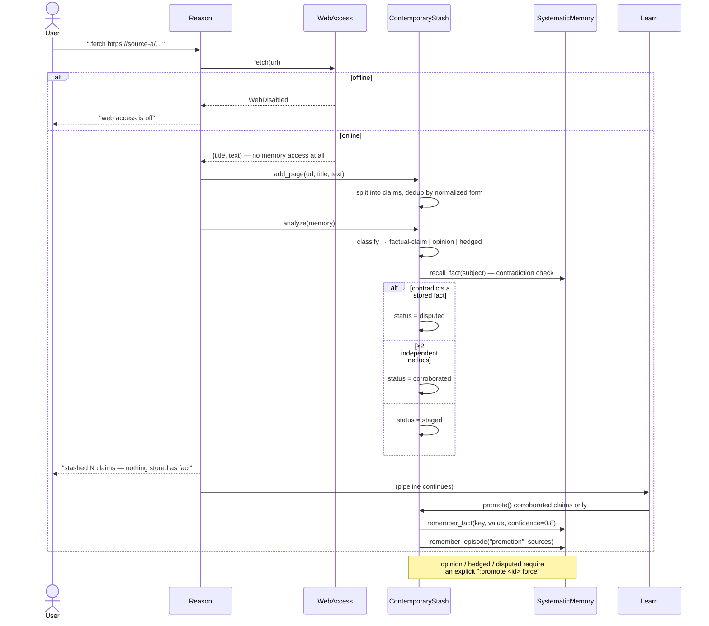
```mermaid
sequenceDiagram
    actor User
    participant TH as Reason
    participant Web as WebAccess
    participant Stash as ContemporaryStash
    participant Mem as SystematicMemory
    participant L as Learn

    User->>TH: ":fetch https://source-a/…"
    TH->>Web: fetch(url)
    alt offline
        Web-->>TH: WebDisabled
        TH-->>User: "web access is off"
    else online
        Web-->>TH: {title, text} — no memory access at all
        TH->>Stash: add_page(url, title, text)
        Stash->>Stash: split into claims, dedup by normalized form
        TH->>Stash: analyze(memory)
        Stash->>Stash: classify → factual-claim | opinion | hedged
        Stash->>Mem: recall_fact(subject) — contradiction check
        alt contradicts a stored fact
            Stash->>Stash: status = disputed
        else ≥2 independent netlocs
            Stash->>Stash: status = corroborated
        else
            Stash->>Stash: status = staged
        end
        TH-->>User: "stashed N claims — nothing stored as fact"
        TH->>L: (pipeline continues)
        L->>Stash: promote() corroborated claims only
        Stash->>Mem: remember_fact(key, value, confidence=0.8)
        Stash->>Mem: remember_episode("promotion", sources)
    end
    Note over Stash,Mem: opinion / hedged / disputed require<br/>an explicit ":promote <id> force"
```

### 4.3 Consolidation

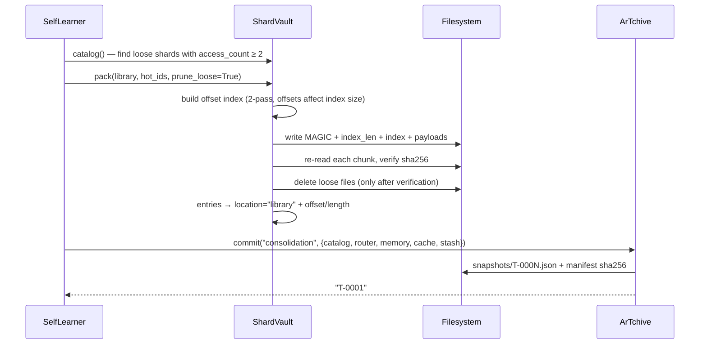
```mermaid
sequenceDiagram
    participant SL as SelfLearner
    participant Vault as ShardVault
    participant FS as Filesystem
    participant Arch as ArTchive

    SL->>Vault: catalog() — find loose shards with access_count ≥ 2
    SL->>Vault: pack(library, hot_ids, prune_loose=True)
    Vault->>Vault: build offset index (2-pass, offsets affect index size)
    Vault->>FS: write MAGIC + index_len + index + payloads
    Vault->>FS: re-read each chunk, verify sha256
    Vault->>FS: delete loose files (only after verification)
    Vault->>Vault: entries → location="library" + offset/length
    SL->>Arch: commit("consolidation", {catalog, router, memory, cache, stash})
    Arch->>FS: snapshots/T-000N.json + manifest sha256
    Arch-->>SL: "T-0001"
```

---

## 5. Lifecycles

### 5.1 Shard lifecycle

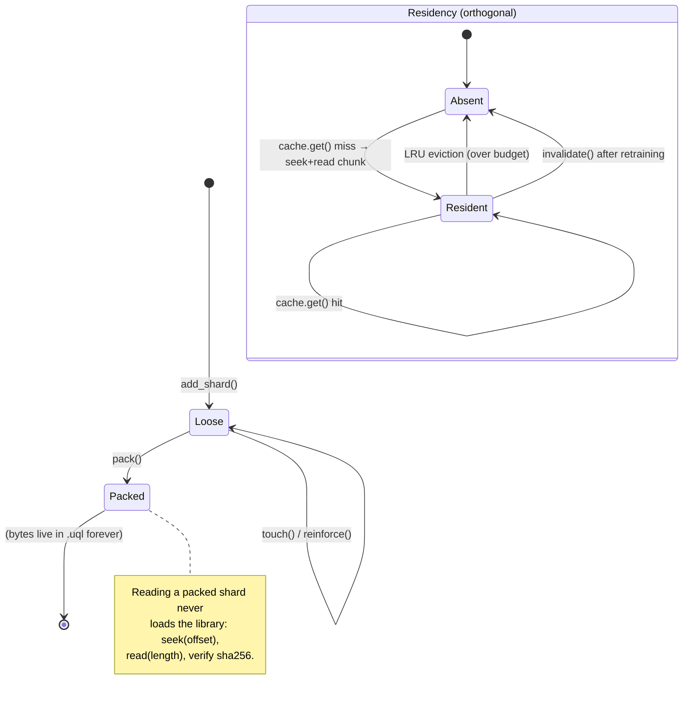
```mermaid
stateDiagram-v2
    [*] --> Loose: add_shard()
    Loose --> Loose: touch() / reinforce()
    Loose --> Packed: pack()
    Packed --> [*]: (bytes live in .uql forever)

    state "Residency (orthogonal)" as R {
        [*] --> Absent
        Absent --> Resident: cache.get() miss → seek+read chunk
        Resident --> Resident: cache.get() hit
        Resident --> Absent: LRU eviction (over budget)
        Resident --> Absent: invalidate() after retraining
    }

    note right of Packed
        Reading a packed shard never
        loads the library: seek(offset),
        read(length), verify sha256.
    end note
```

### 5.2 Stash entry lifecycle

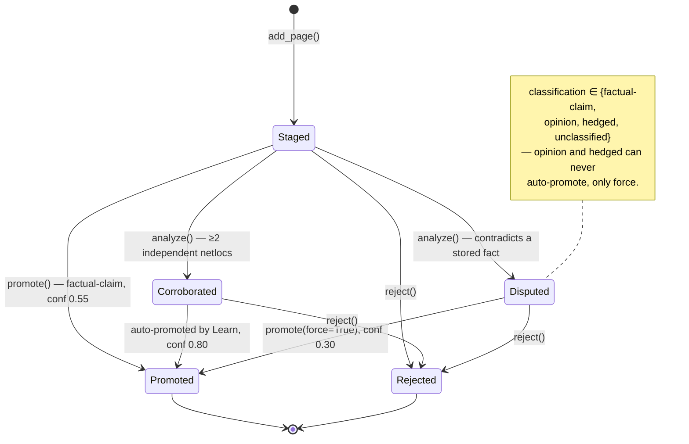
```mermaid
stateDiagram-v2
    [*] --> Staged: add_page()

    Staged --> Corroborated: analyze() — ≥2 independent netlocs
    Staged --> Disputed: analyze() — contradicts a stored fact
    Staged --> Promoted: promote() — factual-claim, conf 0.55
    Corroborated --> Promoted: auto-promoted by Learn, conf 0.80
    Disputed --> Promoted: promote(force=True), conf 0.30
    Staged --> Rejected: reject()
    Corroborated --> Rejected: reject()
    Disputed --> Rejected: reject()
    Promoted --> [*]
    Rejected --> [*]

    note left of Disputed
        classification ∈ {factual-claim,
        opinion, hedged, unclassified}
        — opinion and hedged can never
        auto-promote, only force.
    end note
```

### 5.3 Backend selection

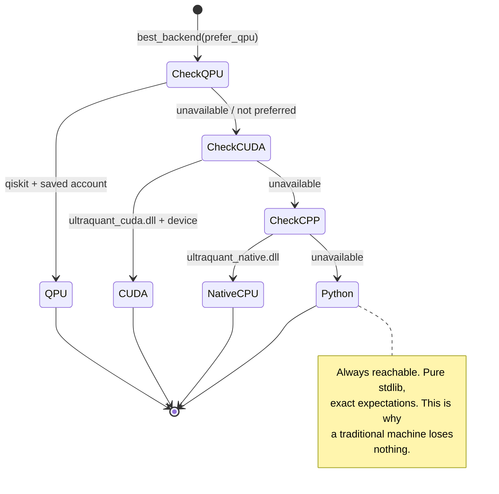
```mermaid
stateDiagram-v2
    [*] --> CheckQPU: best_backend(prefer_qpu)
    CheckQPU --> QPU: qiskit + saved account
    CheckQPU --> CheckCUDA: unavailable / not preferred
    CheckCUDA --> CUDA: ultraquant_cuda.dll + device
    CheckCUDA --> CheckCPP: unavailable
    CheckCPP --> NativeCPU: ultraquant_native.dll
    CheckCPP --> Python: unavailable
    QPU --> [*]
    CUDA --> [*]
    NativeCPU --> [*]
    Python --> [*]
    note right of Python
        Always reachable. Pure stdlib,
        exact expectations. This is why
        a traditional machine loses
        nothing.
    end note
```

---

## 6. Execution tiers and measured performance

All four tiers compute the same values (verified to 1e-9 in
`tests/test_native_*.py`); only speed differs.

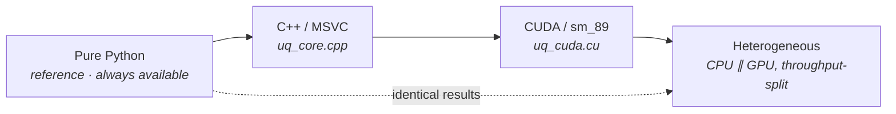
```mermaid
graph LR
    PY["Pure Python<br/><i>reference · always available</i>"] --> CPP["C++ / MSVC<br/><i>uq_core.cpp</i>"]
    CPP --> CUDA["CUDA / sm_89<br/><i>uq_cuda.cu</i>"]
    CUDA --> HET["Heterogeneous<br/><i>CPU ∥ GPU, throughput-split</i>"]
    PY -.->|"identical results"| HET
```

**Measured on RTX 4090 / CUDA 12.6 / MSVC 14.38, Python 3.13:**

| Workload | Pure Python | C++ | CUDA | Winner |
|---|---:|---:|---:|---|
| Feature map, 512 samples × 5 qubits | 21.08 ms | **0.37 ms** (56×) | 0.48 ms (44×) | CPU |
| Single circuit, 18 qubits (262 144 amplitudes) | 5327 ms | 51.9 ms (103×) | **3.61 ms (1475×)** | GPU |
| Ternary inference, 512 × (30→32) | 19.97 ms | 1.93 ms (10×) | **0.86 ms (23×)** | GPU |

**On using CPU and GPU simultaneously.** It is implemented, correct, and
adaptively calibrated — `HeterogeneousFeatureExtractor` marshals the batch once
into a shared buffer, hands each processor a pointer into its own slice (so
neither holds the GIL while computing), runs them concurrently, and reports the
split. But the honest measurement is that **for narrow feature maps it does not
pay**, and the reason is instructive:

| Component (131 072 samples × 5 qubits) | Time | Share |
|---|---:|---:|
| Marshalling Python lists → `array('d')` | 25.9 ms | 43 % |
| Unchunking flat buffer → lists of floats | 33.8 ms | 50 % |
| **C++ kernel** | **4.34 ms** | 7 % |
| CUDA kernel | 22.5 ms | — |

The 4090 is *five times slower than the CPU* at this shape: a 5-qubit
statevector is 512 bytes, it never leaves L1, and the GPU pays PCIe transfer plus
launch overhead for almost no arithmetic. Meanwhile 93 % of wall-clock is Python
data conversion that no split can parallelise. Auto-dispatch therefore measures
throughput (on a probe proportional to the batch, because the ratio is
size-dependent) and hands the whole batch to the winner when one processor is
more than 4× faster. Result: ~0.94× of the best single tier — the residual gap is
the probe itself.

**The GPU's real domain is wide statevectors** (18 qubits: 3.61 ms vs 51.9 ms on
C++), where memory traffic finally justifies the transfer. The lesson is
generic: pick the processor by measured shape, not by reputation.

### 6.1 Training a model library — where the GPU does win

Forging a model is *many independent training problems at once*, which is the
shape a GPU is built for. Measured, 30 epochs, 120 samples/expert, 30→32→8:

| Experts | Pure Python | C++ (32 threads) | CUDA | GPU vs CPU |
|---:|---:|---:|---:|---:|
| 16 | 11 637 ms | 18.2 ms | 17.3 ms | 1.05× |
| 64 | — | 61.2 ms | 52.1 ms | 1.17× |
| 256 | — | 256.8 ms | 195.5 ms | **1.31×** |
| 512 | — | 513.6 ms | 415.4 ms | 1.24× |

Training accuracy is identical across all three tiers at every size. The C++
tier alone is **639× faster than pure Python** (11 637 ms → 18.2 ms at 16
experts); CUDA adds a further 1.05–1.31× over 32 CPU threads.

Getting there took three rounds of measurement, and the first two guesses were
wrong:

1. **Thread mapping** (128 threads, 32 hidden units → most threads idle). Fixing
   it moved 1.05× → 1.09×. Not the bottleneck.
2. **Batch-parallel rewrite.** Each expert's training is inherently *sequential*
   — 3600 sample-steps, each with barriers. Forwarding a whole minibatch at once
   and computing every weight gradient as one batch reduction cut barriers 16×
   and let the update fuse into the gradient (no accumulator arrays at all).
   1.09× → 1.27×. This was the bottleneck.
3. **Barrier cost.** Warp-shuffle reductions (3 barriers instead of 10), two sums
   per barrier sequence, and skipping the loss reduction on every epoch but the
   last: → 1.31×.

Each thread owns whole weight elements and accumulates its batch sum in a fixed
order, so there are **no atomics and the GPU result is deterministic** — which is
why the accuracies match the CPU exactly rather than merely closely.

Honest ceiling: at 256 categories the *training* is 0.32 s of a 1.9 s build —
corpus generation and shard serialization (pure Python) now dominate. Further
kernel tuning would be optimizing the wrong 17%.

---

### 6.2 The quantum layer, measured

Everything here is exact on the simulator and runs on a normal PC.

| Component | What was verified | Result |
|---|---|---|
| Amplitude encoding | fidelity vs target state, widths 1–6, signed | **1.000000000000** |
| Circuit inverse | `C·C†` returns to \|0…0⟩, random 30-gate circuits | **1.000000000000** |
| Parameter-shift gradient | against central finite differences | **3.9e-10** |
| Kernel overlap | inversion test vs swap test vs direct fidelity | agree to **8e-16** |
| Grover search | success probability, N = 8…64 | 0.94–0.99, speedup 2.0×→5.3× |
| Zero-noise extrapolation | error removed at p₂q = 0.005 / 0.01 / 0.02 | **72% / 67% / 16%** |
| Entanglement entropy | product / Bell / GHZ | 0.000 / 1.000 / 1.000 |

Two diagnostics exist because a variational circuit can fail while still
returning plausible numbers. **Separability**: our 5-qubit model measures mean
entropy 0.884, so it is genuinely entangled rather than a disguised product
state. **Barren plateaus**: gradient variance falls 0.105 → 0.0044 across widths
2→6, which is the exponential decay that makes deep random ansätze untrainable
regardless of optimiser.

The ZNE collapse at 2% error is kept visible on purpose: extrapolation leaves its
linear regime and stops helping, which is the honest boundary of the technique.

### 6.3 Quantum vs classical experts

Both trained on identical data, scored on the same held-out split.

Easy task (2 classes, 1-pixel noise):

| category | chosen | quantum acc | classical acc | quantum bytes | classical bytes | smaller |
|---|---|---:|---:|---:|---:|---:|
| lines | quantum | 1.000 | 1.000 | 494 | 4 655 | 9.4× |
| arrows | quantum | 1.000 | 1.000 | 496 | 4 648 | 9.4× |
| frames | quantum | 1.000 | 1.000 | 498 | 4 676 | 9.4× |
| crosses | quantum | 1.000 | 1.000 | 491 | 4 652 | 9.5× |

Harder task (4 classes, 3-pixel noise) — and this is the more informative one:

| category | chosen | quantum acc | classical acc |
|---|---|---:|---:|
| setA | quantum | 1.000 | 1.000 |
| setB | **classical** | 0.917 | 0.958 |

**Quantum lost on setB and the pool kept the classical expert**, which is the
selection mechanism working rather than failing. Across the hard task the
classical mean is higher (0.979 vs 0.958).

The trade, stated plainly: quantum experts are **6.8–9.4× smaller** on disk for
comparable accuracy, and cost **24–44× more to train**, because parameter-shift
needs `2P + 1` circuit evaluations per example. That is worth taking in a paged
library — trained once, paged many times — and not worth taking if you retrain
often. No speedup is claimed anywhere in this table.

---

## 7. The quantum reality check

An honest statement of what the quantum layer does and does not do.

**What is real.** The statevector engine is a genuine from-scratch quantum
simulator: correct gate algebra, entanglement, interference, exact expectation
values, verified against hand-computed Bell states and analytic RY results. The
feature map is a real variational-style encoding with data re-uploading. Circuits
translate to Qiskit and can execute on IBM hardware.

**What is not claimed.** Running the current circuits on a QPU would produce a
*noisier* version of what the simulator already computes exactly — nothing that
the simulation cannot explain. The measured benchmark says so plainly: hybrid
93.3 %, classical 91.7 %, ratio 0.982. There is no quantum advantage here, and
the architecture does not pretend otherwise.

**Why that is by design, not an accident.** Principle 1 makes the exact simulator
the semantic reference. That is precisely what delivers the requirement that the
model stay fully effective on a traditional machine — you cannot simultaneously
have "the classical path loses nothing" and "the QPU does something classically
inaccessible". The 50 % floor is met at ~100 % because the classical path *is*
the reference path.

**What genuine QPU utilisation would require** (roadmap, not implemented):

| Requirement | Why the current design falls short |
|---|---|
| Circuits past classical simulability (≳40 qubits, or deep entanglement) | Current circuits are 5 qubits. **But this is a choice, not a wall** — see [§7.1](#71-what-a-qpu-could-actually-do-for-a-shard-library): a 50-qubit linear-ZZ encoding costs 196 two-qubit gates and is reachable on today's hardware. |
| Topology-aware transpilation, SWAP routing | `QPUBackend` uses a preset pass manager and never optimises for a specific device's coupling map. |
| Error mitigation: ZNE, Pauli twirling, dynamical decoupling | **Zero-noise extrapolation is now implemented and measured** (§6.2): 67–72% of the error removed at realistic noise. Twirling and dynamical decoupling remain absent. |
| Regimes where sampling *is* the result (e.g. sampling-hard distributions, quantum kernels on hard feature spaces) | **`ZZFeatureMap` now provides one** and it is classically hard at width. Measured on the glyph task it *generalises worse* than the cheap map — the open question is which problems reward it. |
| Hardware-native effects used as a resource (true randomness, device noise) | Not exploited. |

Until those exist, treat `QPUBackend` as a *correctness-preserving execution
path*, not a source of exotic outcomes. It is wired, it is honest, and it is off
by default (`prefer_qpu=False`).

---

## 7.1 What a QPU could actually do for a shard library

**This section previously concluded that data loading costs O(N) and closes the
door. That was wrong, and the correction matters.** The measurement was right but
it was taken on *amplitude* encoding alone, and the conclusion was generalised to
encoding as such. Amplitude encoding is the expensive one because it buys
compression — 2**n values in n qubits — and pays for it in gates. Other encodings
do not.

### What encoding actually costs

Two-qubit gates needed to encode data, measured to 12 qubits and projected beyond
(building a 30-qubit amplitude encoder would emit a billion gates):

| qubits | amplitude | angle | ZZ map (full) |
|---:|---:|---:|---:|
| 4 | 14 | 4 | 24 |
| 12 | 4 094 | 12 | 264 |
| 32 | 4 294 967 294 | 32 | 1 984 |
| 50 | 1.1 × 10¹⁵ | **50** | 4 900 |
| 100 | 1.3 × 10³⁰ | **100** | 19 800 |

Amplitude encoding is exponential. Angle encoding is **linear**. The ZZ feature
map is **quadratic** with full entanglement and **linear** with nearest-neighbour
entanglement. So a wide register is not blocked by data loading at all — it is
blocked only if you insist on cramming 2**n values into n qubits.

### The regime that is actually reachable

A ZZ feature map with linear entanglement, 2 repetitions:

| qubits | two-qubit gates | survival at p=0.003 | at p=0.0005 | at p=0.0001 |
|---:|---:|---:|---:|---:|
| 20 | 76 | 0.796 | 0.963 | 0.992 |
| **50** | **196** | **0.555** | 0.907 | 0.981 |
| 100 | 396 | 0.304 | 0.820 | 0.961 |
| 200 | 796 | 0.092 | 0.672 | 0.924 |

**A 50-qubit encoding costs 196 two-qubit gates and survives at ~55% on today's
hardware** — and with zero-noise extrapolation removing 67–72% of the error
(§6.2), that is a usable signal. Fifty qubits is already past exact classical
simulation: 2⁵⁰ amplitudes cannot be stored. So the classically-hard regime is
reachable *now*, with an account, not after error correction.

That is a materially different conclusion from the one this section used to
carry, and it came from measuring the alternatives instead of extrapolating from
the first one tried.

### The honest obstacle is usefulness, not feasibility

Being hard to simulate is not the same as being good. Leave-one-out accuracy and
class separation on the glyph task, each encoding used as a kernel:

| encoding | accuracy | class separation |
|---|---:|---:|
| amplitude (5q) | 1.000 | +0.441 |
| angle (10q) | 0.950 | +0.550 |
| ZZ linear (10q) | 0.950 | +0.103 |
| ZZ full (10q) | 0.900 | +0.100 |

The classically-hard maps **generalise worse here**. That is the expressibility
trade in its usual form: spreading data across an enormous space is exactly what
defeats classical simulation and exactly what dilutes similarity between related
inputs. A map expressive enough to be hard is often too expressive to learn from.

So the open question was not "can we reach the hard regime" — the gate counts say
yes — but "is there a task where the hard map wins". **That experiment has now
been run, and the answer is yes.**

### The task where the entangling map wins

`python -m ultraquant.quantum.benchmark_kernels` builds parity tasks of
increasing interaction order: the label is the parity of a hidden subset of
features, so at order 1 it depends on a single coordinate and at order 2 it
depends on a *product* that no function of individual coordinates can see.
Accuracy, averaged over 5 dataset draws:

| interaction order | linear | quadratic | angle | angle+ent | ZZ linear | ZZ full |
|---:|---:|---:|---:|---:|---:|---:|
| 1 (separable) | 0.830 | 0.850 | **1.000** | 1.000 | 0.610 | 0.510 |
| **2 (XOR-like)** | 0.470 | 0.510 | 0.560 | 0.560 | 0.700 | **0.770** |
| 3 | 0.510 | 0.510 | 0.530 | 0.530 | **0.600** | 0.460 |

The pattern is exactly the one the physics predicts, in both directions:

* **Order 2: the entangling map wins by 0.26** over the best classical kernel
  tested. The ZZ map puts feature *products* into the phase, which is precisely
  the structure the label depends on.
* **Order 1: it loses badly** — 0.510 against the cheap angle map's 1.000.
  Expressive power is not free; spreading data across a huge space destroys the
  simple structure that was there.

The quadratic kernel is in the table deliberately: it is classical and it also
sees pairwise products, so beating only the linear kernel would have shown
nothing. It scores 0.510, because it mixes *all* pairs symmetrically while the
label depends on one specific pair — and the quantum map finds that pair without
being told which one it is.

**What this does and does not establish.** It shows entanglement earning its cost
on a task with genuine feature interactions, against two reasonable classical
kernels, under a deliberately trivial classifier so that the kernel is the only
variable. It does *not* show quantum advantage over all classical methods: a
model given explicit interaction features, or simply a small MLP, would also
learn order-2 parity. The honest claim is narrower and still useful — the
entangling map extracts interaction structure *without being told where to look*,
and that is the property worth scaling to widths where classical simulation
stops.

### What the QPU should touch

The division of labour still holds, for a different reason than before. The
library is hundreds of gigabytes of classical bytes on NVMe; encoding *that*
would be pointless at any gate cost, because the interesting objects are the
patterns, not the storage. The QPU's targets are:

* **model parameters** — a quantum expert is 20 angles, measured 9.4× smaller
  than its classical equivalent (§6.3), and this works today;
* **feature maps over compact derived features** — 10–50 numbers per pattern,
  which is exactly the regime angle and ZZ encodings serve;
* **kernels between patterns**, where the quantum part is the similarity measure
  and everything downstream stays classical.

None of these require loading the library. All three run on hardware reachable
today.

### A staged path, with the gate for each stage

1. **Run the existing circuits on hardware.** `QPUBackend` and `BlueQubitBackend`
   already take them; `mitigation_report` measures whether ZNE closes the gap.
   *Gate: hardware ⟨Z⟩ matching the simulator inside the mitigated error bar.*
2. **Widen to 20–50 qubits with an angle or linear-ZZ map.** Gate counts are
   known (76–196 two-qubit gates) and survival is measured above.
   *Gate: a kernel matrix from hardware that still separates classes.*
3. **Find a task where the hard map wins.** The measurements above say the glyph
   task is not it — it is too easy, and separable classically. Candidates are
   problems with genuinely high-order feature interactions.
   *Gate: hard-map accuracy above the classical baseline on held-out data.*
4. **Error correction** for anything needing thousands of logical gates. Hardware
   timeline, not ours.

Stages 1 and 2 need an account and no new physics. Stage 3 is the real research
question, and it is a question about *problems*, not about hardware.

---

## 8. File formats

### 8.1 `.uql` shard library

```
 offset  0        4                  12                    12+index_len         EOF
         ├────────┼──────────────────┼─────────────────────┼────────────────────┤
         │ "UQL1" │ index_len u64 BE │ index JSON (utf-8)  │ payload bytes      │
         │ 4 B    │ 8 B              │ [{shard_id, offset, │ zlib-compressed    │
         │        │                  │   length, sha256,   │ shard blobs,       │
         │        │                  │   codec, category,  │ concatenated       │
         │        │                  │   kind, signature}, │                    │
         │        │                  │   …]                │                    │
         └────────┴──────────────────┴─────────────────────┴────────────────────┘
                                              │                      ▲
                                              └── offset ────────────┘
                                            (absolute file position)
```

`attach()` reads only the header and index (kilobytes) and merges it into the
catalog; payloads stay on disk until requested. `load_bytes()` then does
`seek(offset); read(length)` — one shard, never the file. Offsets are absolute,
which makes the writer two-pass (the index size depends on the offsets it
contains).

**`signature` is in the index for a reason.** It was not, originally, and the
consequence only shows up on a machine that did not train the library: the index
carried offsets, hashes, categories and kinds, so every expert arrived intact —
and completely unreachable, because pattern routing had nothing to match against
([§4.1.1](#411-routing-a-pattern-that-contains-no-words)). "The model is a
library" has to survive copying the library somewhere else, which is what
`ShippedLibraryTests` checks: attach the parts into a vault that has never seen
them, and all eight glyphs still route and read correctly. Locally-learned
signatures win over the shipped ones on attach, so receiving a library never
overwrites what a machine has learned since.

### 8.2 Sharded libraries

One container per library is wrong once a library is real: it cannot be synced
incrementally, replicated in pieces, spread across volumes, or handed to an
object store, and touching a single shard shadows the whole file. So a library is
a **directory of bounded parts**, the way large models ship as
`part-00001-of-00042`:

```
vault/library/
  library.json                    manifest: format, part list, shard count
  part-00001-of-00005.uql         a complete .uql — own magic, index, payloads
  part-00002-of-00005.uql
  seg002-00001-of-00003.uql       a later expansion wave, its own prefix
  ...
```

**Every part is a complete `.uql`.** Nothing depends on its neighbours, which is
what makes the properties below hold:

| Property | Why it follows |
|---|---|
| Replicate in pieces | A part copied on its own still reads |
| Survive partial loss | A missing part costs only its own shards; `attach_directory` reports it rather than failing |
| Spread across volumes | Parts are ordinary files with no shared state |
| Grow without rewriting | An expansion wave writes new parts under its own prefix |
| One file per shard | `max_shards_per_part=1`, for object stores that want it |

Measured: 40 shards into 5 parts, all readable; deleting a part leaves the
remaining 32 shards readable with the gap named; a cold vault attaches 11 parts
across three expansion waves and reads all 22 shards.

The catalog already stored `library_path` per shard, so reads needed no change at
all — only the writer learned to roll over.

### 8.3 Ar(T)chive

`root/manifest.json` + `root/snapshots/T-000N.json`. Payloads are serialised
canonically (`sort_keys=True`, tight separators) and the manifest records the
SHA-256 of the exact bytes written; `restore()` recomputes it and raises
`IntegrityError` on any mismatch. The name is the pun: a **T**emporal archive of
model ar**T**ifacts, versioned `T-0001`, `T-0002`, …

---

## 9. Testing

```
tests/test_quantum.py          gate algebra, Bell states, little-endian, sampling
tests/test_qlayer.py           feature map, re-uploading, determinism
tests/test_model.py            ternary quantization, STE, XOR convergence, round trip
tests/test_memory.py           reinforcement, revision, persistence, signatures
tests/test_archive.py          commit/restore, tamper detection, diff
tests/test_pattern.py          recognizer accuracy, snapshot fidelity
tests/test_shards.py           vault, pack/attach, chunked reads, LRU eviction
tests/test_experts.py          on-demand paging, continued training, routing
tests/test_codeweb.py          sandbox escapes, gated fetch, stash classification
tests/test_interpreter.py      pipeline order, corroboration flow, CLI end-to-end
tests/test_native_cpu.py       C++ parity vs pure Python (1e-9)
tests/test_native_cuda.py      CUDA parity vs pure Python (1e-9)
tests/test_native_dispatch.py  tier selection, heterogeneous split parity
tests/test_forge.py            corpora, multi-tier training parity, forge pipeline
tests/test_gui.py              window build, chat round trip, forge from the UI
tests/test_storage.py          backends, RAM tier, paged index, working set
tests/test_vendors.py          Pure / 3PAR / Lightbits control planes (mocked)
tests/test_learning.py         gap discovery, question ranking, applied answers
tests/test_ansatz.py           amplitude encoding, parameter-shift, VQC training
tests/test_quantum_advanced.py kernels, noise + ZNE, Grover, entanglement
tests/test_encodings.py        angle / sparse / ZZ maps and their scaling
tests/test_expansion.py        growing a library, compaction, the kernel experiment
tests/test_bluequbit.py        cloud backend against a stub SDK
tests/test_hybrid.py           quantum vs classical expert selection
tests/test_chat_library.py     chat -> recognition -> routing -> library shards
tests/test_unfamiliar_patterns.py  the similarity floor and the teaching loop
tests/test_sketch.py           screen agrees with the exact scan, index staleness
tests/test_multimodal.py       mixed feature widths in one library, no cross-talk
tests/test_encoder.py          the encoder, and the gate's experimental integrity
tests/test_blackboard.py       composition, slots, and the paging discipline
tests/test_tui.py              the terminal UI, console safety, portability
tests/test_hypervector.py      binding algebra, split determinism, gate integrity
tests/test_discovery.py        clustering, chance correction, self-proposed concepts
tests/test_planner.py          goal search, novel capabilities, the goal intent
tests/test_language.py         induction, the no-template proof, grounding
tests/test_seed.py             starter knowledge, vocabulary decisions, the doubt loop
tests/test_prototypes.py       trace consolidation, medoid fidelity, the tripwire
tests/test_scheduler.py        learned dispatch, the three-brain shootout, determinism
tests/test_symbols.py          the Greek letters against their reference values
tests/test_entropy_blackbox.py each entropy test earning its place
tests/test_chat_selflearn.py   the whole self-learning loop at the chat surface
```

`python -m unittest discover -s tests` → **778 tests, all passing, ~153 s.**
Native tests `skipUnless` their tier is present, so the suite stays green on a
machine with no compiler and no GPU.

---

## 10. Limitations and roadmap

**Honest limitations.**
- The interpreter is **symbolic and template-driven** — pattern matching over its
  own stores. It is not a language model and does not generate open-ended prose.
  See [§11](#11-the-distance-to-general) for what that rules out and what closing
  the gap would actually require.
- Corroboration counts *distinct network locations*, which is a weak proxy for
  source independence (two mirrors of one wire story would corroborate).
- Sentence-level claim splitting is regex-based; it will mis-split some prose.
- The sandbox is a whitelist over a deliberately small language, hardened against
  the standard `__class__`/import/attribute escapes — not a general Python jail.
- `--timeout` on sandboxed code cannot forcibly kill a wedged worker thread; the
  operation budget is the real backstop.
- No QPU advantage, as set out in [§7](#7-the-quantum-reality-check); the
  data-loading wall in [§7.1](#71-what-a-qpu-could-actually-do-for-a-shard-library)
  is why that is unlikely to change for the library itself.
- The vendor control planes (Pure, 3PAR, Lightbits) and the BlueQubit cloud
  backend are **written to published documentation and tested against mocks**.
  Neither has been run against real hardware.
- Quantum experts cost 24–44x more to train than classical ones; they pay for
  themselves only in a library that is trained once and paged often.
- "GPU and CPU together" splits correctly and is measured at 0.92–0.95x of the
  best single device: Python-level marshalling dominates, so the split cannot
  win until that is moved into C.
- **The unfamiliar-pattern floor is a dissimilarity test, not out-of-distribution
  detection** ([§4.1.1](#411-routing-a-pattern-that-contains-no-words)). A novel
  pattern that resembles a known one is still reported as that one — measured at
  4/6 novel glyphs flagged, with 0 false alarms on 56 known and noisy-known
  cases. Neither cosine similarity nor expert confidence separates novel from
  known well enough to do better, and this is measured rather than assumed.
- Pattern routing compares against stored prototypes, so a category's routing
  quality degrades as its prototype set grows unrepresentative. Nothing prunes or
  clusters prototypes yet.
- The resident catalog is 37 MB at 20,000 categories, against 223.5 GB of
  library on disk — a 1:6,200 ratio. Roughly 12 MB of that is signature vectors
  and the rest is per-entry metadata (sha256 hex, ISO timestamps, ids). Cutting
  it further means changing the on-disk catalog format, which has not been
  judged worth it.

**Roadmap.**

Capability work — the staged path toward generality, each step with a
falsifiable gate — is in [§11.3](#113-a-staged-path-with-the-gate-for-each-stage).
Stage 0 is done. The items below are engineering on the existing substrate; they
make the system better at what it already does and do not, on their own, make it
more general.

1. ~~Zero-copy output path for the native tiers~~ — done: `accel.Rows`; the
   join is free, the remaining cost is *input* flattening (see below).
2. Source-independence scoring for corroboration (registrable-domain grouping,
   citation graphs) rather than bare netloc counting.
3. Run the existing circuits on real hardware and measure the mitigated gap
   (§7.1 stage 1) — reachable today with an account.
4. Widen to a 20-50 qubit angle or linear-ZZ map on real hardware — gate
   counts and survival are already measured (§7.1 stage 2).
5. Find a task whose feature interactions reward a classically-hard map;
   the glyph task demonstrably does not (§7.1 stage 3).
6. Shard-level mmap and streaming for libraries beyond available address space.
7. ~~Prototype clustering per category~~ — done: `shards/prototypes.py`,
   consolidation in the housekeeping pass plus a teaching tripwire; see the
   note below §11.10's deployment section.
8. A genuine out-of-distribution test to replace the dissimilarity floor —
   density estimation over the signature space, or an explicit reject class
   trained on the categories a library does *not* hold.

---

## 11. The distance to general

This section exists because the question was asked directly: is this the start of
a general system? The answer matters more than the flattering version of it, so
what follows is an assessment first and a plan second.

### 11.1 What this is, stated plainly

**It is a narrow pattern-recognition system with unusually good memory and
provenance machinery.** Four properties bound it, and none is a matter of scale:

| Bound | Where it lives |
|---|---|
| The perceptual world was 25 pixels | `render()` fixed at 5x5; features 25 + 5 row means |
| Reasoning is one route → one expert → one label | `Reason._glyph` — no chaining, no intermediate state |
| Language is template fill-in | six regex-dispatched intent handlers |
| Learning needs a labelled demonstration *and* a human-supplied category name | `teach_glyph`, `LearningSession` |

A system with those bounds cannot generalise no matter how large the library
grows. Adding categories, shards, parameters or qubits scales the **substrate**,
not the cognition — which is why "1.2 trillion parameters" is a storage claim in
this architecture and has never been presented as a capability one.

What *is* real, and is worth building on:

- a catalogued, pageable library at a **1:6,200** resident-to-stored ratio
  ([§4.1.1](#411-routing-a-pattern-that-contains-no-words)) that ships between
  machines intact ([§8.1](#81-uql-shard-library));
- content-addressed routing that reaches the right expert without reading shards;
- an exact quantum simulator with hardware-compatible gradients ([§3.1](#31-quantum-engine));
- **found ≠ believed** — a quarantine that makes provenance a property of every
  stored fact ([§4.2](#42-web-intake--found-vs-believed));
- the seed of metacognition: the system can say *"I do not recognise that"* and
  turn the gap into a question it asks unprompted.

That last one is the only item on the list that is about cognition rather than
plumbing, and it is deliberately modest — a dissimilarity test with measured
error rates, not novelty detection.

### 11.2 The two things actually missing

Strip away the details and the gap reduces to two absences.

**No shared representation.** Every expert sees raw pixels. Nothing learned in
one category is available to any other, so the hundredth category costs exactly
what the first did. Transfer is the difference between a lookup table and a
learner, and there is currently no mechanism for it.

**No composition.** One input selects one expert and produces one label. There is
no way to represent *"an arrow inside a frame"*, because there is nowhere for two
partial results to meet. Generality is mostly recombination, and the architecture
has no combining surface.

Everything else — grounded language, planning, self-modelling — sits downstream
of those two.

### 11.3 A staged path, with the gate for each stage

Each stage has a **falsifiable gate**: a measurement that says whether it worked.
A stage that fails its gate does not get built on. This is the same discipline
applied to the QPU question in [§7.1](#71-what-a-qpu-could-actually-do-for-a-shard-library),
where the honest conclusion was that the data-loading wall is real.

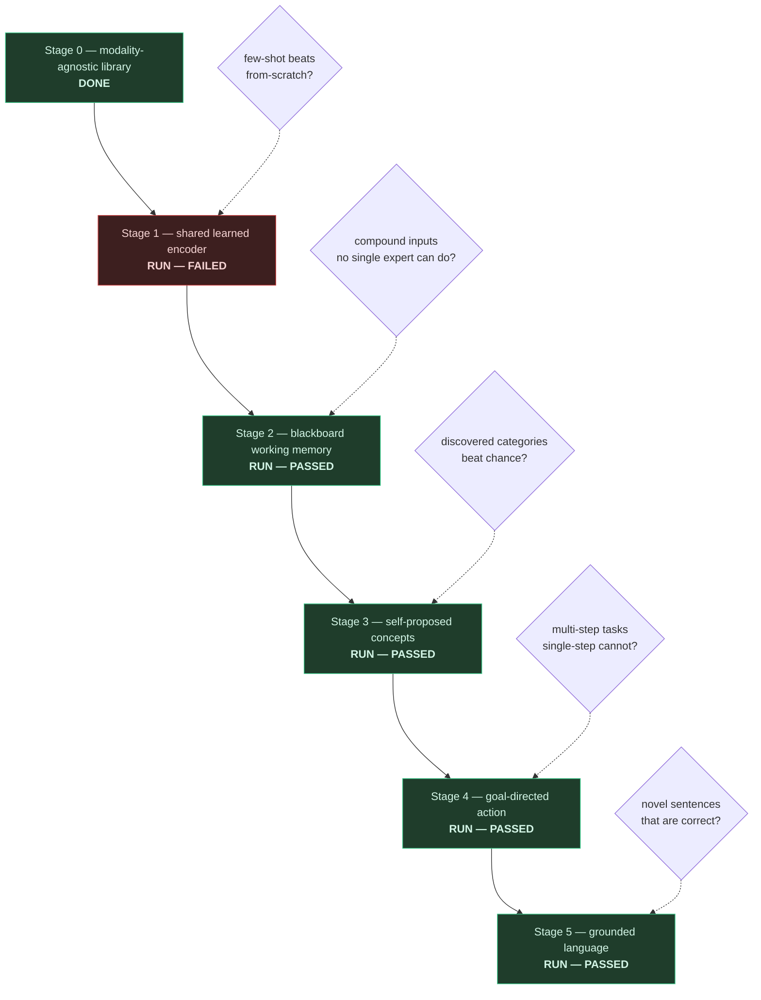
```mermaid
flowchart TD
    S0["Stage 0 — modality-agnostic library<br/><b>DONE</b>"] --> S1
    S1["Stage 1 — shared learned encoder<br/><b>RUN — FAILED</b>"] --> S2
    S2["Stage 2 — blackboard working memory<br/><b>RUN — PASSED</b>"] --> S3
    S3["Stage 3 — self-proposed concepts<br/><b>RUN — PASSED</b>"] --> S4
    S4["Stage 4 — goal-directed action<br/><b>RUN — PASSED</b>"] --> S5
    S5["Stage 5 — grounded language<br/><b>RUN — PASSED</b>"]

    G1{"few-shot beats<br/>from-scratch?"} -.-> S1
    G2{"compound inputs<br/>no single expert can do?"} -.-> S2
    G3{"discovered categories<br/>beat chance?"} -.-> S3
    G4{"multi-step tasks<br/>single-step cannot?"} -.-> S4
    G5{"novel sentences<br/>that are correct?"} -.-> S5

    classDef done fill:#1f3d2b,stroke:#3ac98a,color:#d3f5e6
    classDef dead fill:#3d1f1f,stroke:#c93a3a,color:#f5d3d3
    class S0,S2,S3,S4,S5 done
    class S1 dead
```

**Stage 0 — the library stops being single-modality.** *Done.* `ExpertPool` no
longer imposes one `input_dim` on every expert it creates; the width comes from
the training data and is stored per expert. The sketch index is segregated by
feature width, so a 30-feature glyph and a 12-feature text vector cannot be
compared — that used to happen silently by truncating to the shorter vector.
Feeding an expert the wrong modality now raises rather than answering
confidently.
*Gate: two modalities coexist in one library, route independently, survive
packing and attaching, and never cross-talk.* **Met** — `tests/test_multimodal.py`.

**Stage 1 — a shared encoder.** One representation over the feature space, with
experts reading it instead of raw pixels, so that what is learned for one
category is available to the next.
*Gate: a held-out category trained on 5 examples through the encoder beats the
same category trained on 5 raw-pixel examples, by a margin larger than seed
variance.*
**Run. FAILED — see [§11.5](#115-stage-1-was-run-and-it-failed).** The stage is
abandoned in this form, and the failure changed the order of what follows.

**Stage 2 — a blackboard.** A per-input working structure that several experts
write into and a combiner reads, replacing single-expert dispatch. This is the
combining surface the architecture lacked.
*Gate: correct answers on compound inputs that **no** single expert classifies
correctly.* Composition that only reproduces single-expert results has not
composed anything.
**Run. PASSED — see [§11.6](#116-stage-2-was-run-and-it-passed).** Shipped in
`ultraquant/reason/blackboard.py` and wired into the interpreter.

**Stage 3 — concepts the system proposes itself.** Cluster episodic traces and
offer the clusters as candidate categories, instead of requiring a human to name
one. `LearningSession` already asks questions; this changes *who chooses what is
worth learning*.
*Gate: discovered clusters align with held-out labels above chance, measured with
an assignment-invariant score.*
**Run. PASSED — see [§11.8](#118-stage-3-was-run-and-it-passed).** Shipped in
`ultraquant/reason/discovery.py` and wired into learning mode.

**Stage 4 — goal-directed action.** The pipeline is `Perceive → … → Respond`;
it never chooses to *do* anything. A planner that selects among available actions
(query the library, run sandboxed code, fetch and quarantine, ask the user) to
satisfy a goal makes it an agent rather than a responder.
*Gate: solves multi-step tasks that the single-step pipeline cannot, without a
hand-written script per task.*
**Run. PASSED — see [§11.9](#119-stage-4-was-run-and-it-passed).** Shipped in
`ultraquant/reason/planner.py` + `actions.py`, reachable as `goal:` in chat.

**Stage 5 — grounded language.** Templates replaced by composition over learned
concepts.
*Gate: produces correct sentences it was never given a template for.*
**Run. PASSED — see [§11.10](#1110-stage-5-was-run-and-it-passed).** Shipped in
`ultraquant/reason/language.py`; the model speaks about what it perceives.

### 11.4 What this would and would not be

If every gate above were met, the result would be a **compositional few-shot
learner with durable memory, provenance, and self-directed curiosity** — a
genuinely interesting system, and a defensible use of the word *architecture*.

It still would not be AGI, and the reason is worth writing down rather than left
implicit: nothing in stages 0–5 addresses open-ended goal formation, robust
transfer to domains structurally unlike the training distribution, or the
capacity to reformulate a problem. Those are not deferred implementation work.
They are unsolved.

The value of the staged form is that each step is independently useful and
independently falsifiable. Stage 1 either buys transfer or it does not, and the
measurement is cheap. That is the difference between an architecture and an
aspiration — and it is the same reason [§7.1](#71-what-a-qpu-could-actually-do-for-a-shard-library)
concludes that the QPU cannot help the library today, instead of promising that
it will.

### 11.5 Stage 1 was run, and it failed

The gate in [§11.3](#113-a-staged-path-with-the-gate-for-each-stage) was written
before the experiment. This section reports what happened, including the parts
that would have been easier to leave out.

**Setup.** Seven families of four labels each; the last family is held out. Each
label is the union of two strokes drawn from a shared vocabulary of eleven
(`ultraquant/experiments/transfer_gate.py`). Every stroke *pair* is globally
unique, so a held-out label cannot be recognised by memorising a combination seen
during pretraining — but every *part* of it was seen. That is the structure a
shared representation should be able to reuse, and it is the most favourable
honest setting for the hypothesis.

The comparison is **paired**: per seed, the same data, the same held-out family,
the same classifier architecture and the same hyperparameters in both arms. Only
the input representation differs.

**A control, because the structured result alone would prove nothing.** The same
measurement is run on unstructured families, where labels are arbitrary pixel
patterns sharing no parts. Transfer *must* fail there. A method that helps in
both conditions is adding capacity, not transferring structure — and would sail
through a gate that only tested the favourable case.

**The first run was invalid and is worth recording.** At the original noise level
the baseline scored **0.992**, so neither arm had room to differ and the
experiment could not have detected transfer in either direction. It reported a
confident FAIL that meant nothing. The noise level was then calibrated **on the
baseline arm alone**, before the encoder was run — choosing an operating point
from baseline difficulty is legitimate; choosing it from the treatment's result
would not be. `tests/test_encoder.py` now asserts the baseline stays off both
ceiling and floor, so this cannot silently recur.

**Two mechanisms were tried, not one.**

| mechanism | compositional | control (should not help) |
|---|---:|---:|
| masked reconstruction (unsupervised) | +0.001 ± 0.067 | −0.123 ± 0.090 |
| discriminative trunk (supervised across pretraining families) | +0.014 ± 0.069 | −0.118 ± 0.082 |

*24 paired seeds, 5-shot, baseline 0.72. The discriminative trunk was re-run at
100 seeds: **+0.0140, 95% CI [+0.0002, +0.0278]**.*

**The verdict, and the temptation in it.** At 100 seeds the discriminative
trunk's interval clears zero, and it would have been easy to call that a pass.
It is not one. The gate asked for a margin **larger than seed variance**, and the
seed-to-seed standard deviation is 0.0705 — the effect is **0.2× the noise a
practitioner would actually see**. Clearing zero at n=100 is a statement about
the precision of an average, and enough seeds will make it true of an
arbitrarily small effect. The code now reports `delta / seed sd` next to
`distinguishable from zero` so the two questions cannot be confused, and the
gate criterion is the one that was written down.

**Why it failed, which is the useful part.** Both representations *worked* as
machinery — reconstruction loss fell 0.234 → 0.099, embeddings did not collapse,
and the null held across bottleneck widths 16/24/32 and training budgets
40/100/200 epochs. The problem is the premise. For these patterns **raw pixels
are already close to an ideal representation**: classes are unions of strokes,
linearly separable in pixel space. A bottleneck over that can only lose
information, which is exactly what the control shows at −0.12. On compositional
data the learned structure roughly cancels its own compression cost, and no more.

**What that changes.** The *need* for shared representation is not refuted; the
idea that you get it by compressing the existing feature space is. Transfer
requires a representation that raw features do not already provide — which means
either a perceptual domain where pixels are a poor representation, or a mechanism
that **adds** structure rather than compressing it.

Composition is such a mechanism, so **Stage 2 now comes first**. A blackboard
that lets several experts contribute partial results builds representational
structure that is not present in the input at all, rather than re-encoding what
is. If composition lands, the shared-representation question is worth reopening
over composed features — where the premise that failed here would no longer hold.

This is what the staged form is for. A cheap experiment moved the roadmap instead
of a plausible story surviving into the architecture unmeasured, which is the same
outcome as [§7.1](#71-what-a-qpu-could-actually-do-for-a-shard-library) reaching
the conclusion that the QPU cannot help the library today.

### 11.6 Stage 2 was run, and it passed

Composition is the second of the two absences in
[§11.2](#112-the-two-things-actually-missing), and unlike the first it survived
its gate. `ultraquant/reason/blackboard.py` is the combining surface: a shared
workspace, independent contributors that read and write it, and a controller that
runs them to quiescence.

Three things make it more than a loop over experts:

* **Slots.** A contribution is filed against an *aspect* of the input. Two
  contributors on the same slot compete; two on different slots compose.
* **Rounds.** A contributor sees what earlier ones wrote, which is what lets a
  constraint *repair* a weak reading rather than merely veto it — it revises the
  least confident slot, so a confident factor corrects an uncertain one.
* **Opting out.** `applies()` lets a contributor decline, so answering one
  question does not consult everything the library holds.

#### The result

Seven border shapes × four interior marks, overlaid on one 5×5 grid. Training
sees 10 of the 16 combinations; the other 6 are never seen *together*, though
every part of them is seen apart. **Both experts read the whole image** — handing
one the border pixels and the other the interior would do the decomposition by
hand and leave nothing to learn.

| | seen pairs | unseen pairs |
|---|---:|---:|
| monolithic (given the pair output space) | 0.955 | **0.000** |
| composed (blackboard) | 0.940 | **0.539** |

*12 seeds. Chance on a pair is 1/16 = 0.0625; delta on unseen +0.539 at 2.42×
seed variance, against the same > 1.0 bar Stage 1 was held to.*

**The hollow way to pass this was avoided.** A compound input is named by a
*pair*, and no single expert has pairs in its output space — so "no single expert
gets it right" is true by construction and proves nothing. The baseline is
therefore a monolithic classifier **given the pair output space directly**, all
16 classes, same images, same budget. Its 0.955 on seen pairs is what makes the
0.000 on unseen pairs meaningful: the arm is strong, and it fails only where it
has no training signal. Composition scores 0.539 there because it never needed
one.

**What limits the 0.539.** Diagnosis, not excuse: the shape factor generalises
well (0.88–0.99 on unseen pairs) and the mark factor does not (0.24–0.93), with
pair accuracy tracking their product — so composition is working and one factor
is simply hard to see. The cause is a flaw in the vocabulary chosen before any
result was known: `dot` ⊂ `bar` ⊂ `plus`, three nested marks that two pixels of
noise can turn into one another. A secondary condition with a non-nested
vocabulary (`DISTINCT_MARKS`) scores **0.682**. The gate number stays 0.539,
because restating a passing result on an easier task is worth less than reporting
why it was capped.

#### Delivered into the system, not left in a script

The interpreter composes across whatever aspects the library declares. A category
records the slot it fills; the reasoning step consults the **best-routed category
per slot**, so:

- a library that never declares slots pages exactly one expert and behaves as it
  always did — categories are alternatives and compete;
- a library that declares two aspects pages exactly two, one per aspect, and
  answers `shape:corners + mark:plus`.

That keeps the paging discipline honest: one expert per aspect of the answer and
never more, which is [principle 2](#1-design-principles) intact. Slots survive
re-training, packing and shipping, alongside signatures.

**An escalation heuristic was built and then removed.** The first wiring
consulted a runner-up expert whenever the leading reading looked weak or routing
was close. Measured over 200 noisy glyphs it fired 8 times and changed **no
answer at all**, so it was deleted rather than kept on the argument that it might
help somewhere. The same standard that failed Stage 1 applies to a feature inside
a stage that passed.

**A tension worth naming.** The unfamiliar-pattern floor
([§4.1.1](#411-routing-a-pattern-that-contains-no-words)) judges similarity
against *whole* stored prototypes, while composition works at the level of
factors. A genuinely novel *combination* of familiar parts is unlike anything
stored as a whole, so the floor can report it as unfamiliar even though the
blackboard could read it — observed on 1 of 6 held-out combinations. For a
factored library the floor should apply per slot. That is not done, and it is
recorded here rather than left to be discovered.

### 11.7 Hypervectors: half a pass

Stage 2 shipped composition as a flat `{slot: value}` dict. A dict cannot nest
with repeated slot names, cannot be one fixed-width object, and cannot be dropped
into the library's similarity index. `ultraquant/reason/hypervector.py` is the
representation that can: concepts as 10,000-bit random vectors, **bind** = XOR,
**bundle** = per-bit majority, **permute** = rotation, **similarity** = XOR +
popcount.

It fits this project unusually well. Python's arbitrary-precision integers do
XOR, AND and `bit_count` in C across every bit at once, so the whole algebra is
bit-parallel **with no extension module** — measured at 25.8 bit-operations per
nanosecond, **807× faster** than the equivalent float dot product in pure Python.
One vector is 1,250 bytes, so a whole composed scene sits in L1. It also runs
unchanged on one core and splits across many, because counting is associative and
nothing is random at runtime.

#### The gate, stated in advance

> Represent and correctly query **nested** structure the flat slot dict cannot
> hold, **and** retrieve that whole scene from the library by similarity, at
> ≥90%, at depth 3 with 24 scenes.

| task | result | target | |
|---|---:|---:|---|
| A. structural query | **1.000** (sd 0.000) | 0.90 | **PASS** |
| B. scene retrieval | **0.743** (sd 0.179) | 0.90 | **FAIL** |

Depth scaling shows where each half lives: structural query holds at **1.000 for
depths 2–5** and 0.966 at depth 6, while retrieval sits at 0.62–0.70 throughout.

**Verdict: the gate was a conjunction, so it FAILS.**

#### What passed is real

Nesting is recovered exactly, at every depth measured. `frame(box(arrow))` is one
1,250-byte vector at any depth, and each level unbinds back to its filler. The
flat slot dict genuinely cannot hold this — two container levels collide on one
key — so that half is not an optimisation wearing an architecture costume.

#### What failed, and why

Unbinding is exact **because the key is known**. Comparing whole scenes is lossy:
each level of bundling adds crosstalk, and the difference between scenes sharing
most of their levels sits underneath it. That is a property of superposition, not
a tuning problem.

#### Two flaws in the experiment, recorded rather than quietly fixed

Both would have produced a confident wrong answer, and both are the same class of
error as the ceiling effect in [§11.5](#115-stage-1-was-run-and-it-failed).

**The task had no answer.** Cues were made by corrupting one level at random.
Measured afterwards, the best accuracy *any* method could reach was **0.000 at
depth 2 and 0.246 at depth 3** — a corrupted cue sat as close to other library
scenes as to the one it came from. Both arms scored at that ceiling, so the first
run was measuring the ambiguity of the task. Rejecting ambiguous cues puts the
oracle at exactly 1.000, and 0.743 is the number that came out of the fixed task.

**The baseline was the oracle.** A path-keyed dict compared by Jaccard was chosen
specifically to avoid the hollow claim that "a dict cannot nest" — it nests fine
with keys like `0/container`. But Jaccard over path keys **is** the ground-truth
similarity the task is defined by, so that arm scores the oracle by construction
and no lossy representation can ever beat it. Requiring hypervectors to beat it
was unwinnable: the mirror image of Stage 2's hollow pass, and just as useless.
Task B is therefore judged on its absolute number against the pre-registered
target, with the baseline reported as what it is.

#### Disposition

The module stays, scoped to what it demonstrated: **structured representation and
exact structural query**, not library retrieval. Nothing in the architecture is
changed to depend on whole-scene similarity, and no claim is made that it works.

A bug found during this work is worth carrying forward, because it was silent.
Majority ties were broken with the XOR of the inputs — deterministic, so it
satisfied the cross-core requirement. But a tie at even *n* means exactly *n*/2
ones, and when *n*/2 is even their XOR is **always 0**: the tiebreak was
degenerate precisely where it was used. Bundles came out at 4,053 of 10,000 bits
instead of ~5,000, and that density bias made every unbound probe resemble the key
it was unbound with, costing 11 of 48 retrievals. Ties now break on a hash of the
counter planes, which is order-independent, so any split of the work still agrees.

| | before | after |
|---|---:|---:|
| bundle density | 4,053/10,000 | ~5,010/10,000 |
| capacity, cleanup over 128 items | 37/48 | **64/64** |

### 11.8 Stage 3 was run, and it passed

Everything the model knew, it knew because a person named a category and
demonstrated it. Learning mode already chose *which* gap to ask about, but the
vocabulary of possible answers still came from outside. `ConceptDiscovery` closes
that: it looks at what recognition could not place, finds groups in it, and asks
only what to call them.

The raw material is already being produced. Patterns the router cannot place are
recorded as `unknown-pattern` episodes
([§4.1.1](#411-routing-a-pattern-that-contains-no-words)) — which are exactly the
observations a genuinely *new* concept would have to be made of.

#### The result

| measure | value |
|---|---:|
| adjusted Rand index vs true classes | **1.000** (sd 0.000) |
| chose the true number of classes | **100%** (12/12) |
| control: labels shuffled | **+0.002** |
| control: no structure at all | **−0.000** (sd 0.016) |

*12 seeds, target ARI ≥ 0.50 pre-registered.* **PASS.**

**The class count is never supplied.** Handing the clusterer the true *k* would
leak the answer into every number above. `discover()` searches k in 2–8 and picks
by silhouette, which uses only geometry and never a label — and it landed on the
right count in every one of the 12 runs.

**ARI, not accuracy.** Cluster 0 here and cluster 3 there may be the same set, so
accuracy is undefined. The adjusted Rand index counts agreeing pairs and
subtracts the agreement expected by chance, which is what makes "above chance" a
statement about zero rather than about a baseline that has to be argued for. Both
controls sitting at zero is what says the metric and pipeline are sound; without
them a headline of 1.000 would be worth very little.

#### Where it stops working

A perfect score is exactly what made Stage 1's first run meaningless, so the
operating point was pushed until it broke:

| noise (pixels flipped) | 3 | 5 | 7 | 9 | 11 |
|---|---:|---:|---:|---:|---:|
| ARI | 1.000 | 0.991 | 0.462 | 0.054 | −0.009 |
| silhouette | 0.330 | 0.170 | 0.077 | 0.054 | 0.054 |

It also degrades with less evidence per concept — ARI 0.958 at 18 examples per
class, 0.530 at 10, 0.371 at 4 — and **silhouette systematically under-counts
above four classes**: at 5 and 6 true classes it still chooses k = 4, scoring
0.775 and 0.674 by merging groups. The gate's operating point is therefore an
easy one, and that is stated rather than left for someone to find.

#### The floor that stops it inventing categories

k-means always returns clusters. A system that proposes its own concepts will
therefore confidently manufacture them out of noise unless something stops it,
and at 9+ flips it was still proposing k ≈ 3 groups with silhouette 0.05.

Measured over 20 datasets each: genuine structure never scored below **0.314**,
and structureless data never above **0.104**. `SILHOUETTE_FLOOR = 0.12` sits in
that gap, and it tracks usefulness rather than merely separating the extremes —
at the noise levels where it starts refusing, the clustering it would have offered
had already fallen to ARI 0.46 and below. Below the floor, the model says nothing.

#### Delivered into the system

`LearningSession` gained a `proposed-concept` gap, scored **2.2** — above
`unknown-pattern`, because naming one group settles several unplaceable inputs at
once. Answering it creates the category and trains it on every member of the
cluster.

End to end, on a library forged from the built-in taxonomy and then shown 28
patterns from two families it had never been taught: it placed none of them,
**proposed exactly two concepts** of sizes 14 and 14 at silhouette 0.377, and
naming one trained it to accuracy 1.00 and made it routable in a fresh session —
with the original categories untouched.

That is the loop this stage was for: *met something I cannot place → decided
these belong together → asked what they are called → learned it.* The model still
cannot invent the name. It can now invent the question.

### 11.9 Stage 4 was run, and it passed

The pipeline dispatches one input to one handler, so it can answer "what is the
tower height?" and cannot answer "add it to the bridge length" — not for want of
pieces but because nothing ever decides to do *two* things in order.
`ultraquant/reason/planner.py` is a plain breadth-first forward search over
declared actions; `actions.py` declares nine capabilities the session already
had (recall, four arithmetic ops, recognise, categorise, count shards, sandboxed
evaluation), each stating what it needs and what it produces. Order is found,
never written.

#### The result

| | planner | single-step pipeline |
|---|---:|---:|
| all 9 tasks | **9/9** | 3/9 |
| the 6 genuinely multi-step tasks | **6/6** | **0/6** |

Longest plan 5 steps, pool of 9 actions, goals stated as conditions — most say
only "a value derived from these facts", not which operation or in what order.

**The clause that does the work is "without a hand-written script per task"**,
and four things guard it:

* the pool is wider than any task needs, so selection is a real choice;
* tasks supply goals, never sequences;
* two tasks are single-step *by design*, so the baseline solving them (3/9) is
  what shows the comparison is fair rather than rigged;
* a capability invented **after** the planner was written — `square`, registered
  from outside — was folded into a plan for a goal nobody anticipated, with
  `planner.py` untouched. A dispatch table cannot pass that test; a planner does
  not notice the difference.

One task initially failed and the failure was a real bug: the sandbox action
called `float()` on `coder.run()`'s result dict, raised `TypeError`, and
silently became "never applicable" — the planner's honest report of an
unreachable goal is what surfaced it.

Delivered as the `goal:` intent in chat. The same request through both paths:

    > add the tower height to the bridge length
    That lands near 'tower height', which I hold as: 324.

    > goal: the tower height and the bridge length
    Plan (3 steps): recall(tower height); recall(bridge length);
                    add(bridge length, tower height)
    Result: bridge length+tower height = 810

It is a prefix rather than a guess because inferring goals from free text is a
different problem, and getting it wrong would silently route ordinary questions
into a search.

#### Facts moved into the library (found by the user, not by a gate)

While Stage 4 was being wired, a structural inconsistency surfaced: **facts were
stored in `memory.json` and nowhere else** — not sharded, not paged, invisible to
the vault's keyword index, left behind when a library was packed and shipped, and
outside the reinforcement loop. Four stated properties broken at once, and the
planner's first draft leaned on it by reading the private fact dict directly.

`ultraquant/memory/factshards.py` fixes it structurally. Facts hash into
**bucket shards** (256 buckets; one shard per fact would bloat the catalog, one
shard for all would page the whole store), each bucket carrying its keys'
keyword associations in the catalog, so facts sit on the same routing path as
everything else. Measured on a 60-fact store, cold session each time:

| operation | buckets paged |
|---|---:|
| direct recall | **1** of 54 |
| selective search ("item37 weight") | 8 of 54 (bounded) |
| unselective search ("weight") | 8 of 54 (bounded, was 54) |

`memory.json` no longer carries facts when a vault is present; old stores are
migrated on first open. A `SystematicMemory` with no vault behaves exactly as it
always did. Two more callers were found reading the private dict (learning
mode's shaky-fact survey, the chat `:facts` command) and moved to the public
API — reaching for the dict was how learning mode went blind the day facts
moved.

### 11.10 Stage 5 was run, and it passed

The interpreter's responses were templates, and a template can only say what
someone anticipated. `ultraquant/reason/language.py` learns to say things
instead: from `(utterance, meaning)` pairs it induces a **lexicon** (which word
realises which concept, by co-occurrence exclusivity), an **order** (mark before
or after its containers; containers inner-first or outer-first, by majority
vote), and a **frame** (the function words before the first content word and
between each adjacent *role pair*). Meanings are the same structures the
blackboard produces when it reads a compound glyph, which is what makes the
language grounded: the words bottom out in perception, not in other words.

#### The result

Two hidden languages live in the experiment — `"a speck inside a box inside a
grill"` (mark first, inner-first) and `"a grill holding a box holding a speck"`
(mark last, outer-first) — with several surface words deliberately unlike their
internal atom names, so string matching cannot substitute for learned alignment.

| clause (pre-registered) | target | 'nested' | 'holding' |
|---|---:|---:|---:|
| held-out combinations, exact | ≥ 0.80 | **1.000** | **1.000** |
| held-out combinations, content | ≥ 0.90 | **1.000** | **1.000** |
| depth 4, never seen at all, exact | ≥ 0.80 | **1.000** | **1.000** |
| comprehension (parse back), exact | ≥ 0.80 | **1.000** | **1.000** |
| control (no consistent mapping) | ≤ 0.10 | **0.000** | **0.000** |

*10 seeds per language; memoriser baseline 0.000 on held-out by construction —
the sanity line, not the competitor (§11.6's lesson).* **PASS on every clause.**

**The no-template proof has three parts.** The same code learns both languages,
and one baked-in order could satisfy one but never both. The hidden languages'
words appear in **no string literal and no identifier** of the learner's source
— asserted by a test that parses the AST, because a template would have to live
in one of those. And the depth-4 clause: the frame is keyed by *role pair*, not
by position, so a language learned at depths 2–3 is spoken correctly one
recursion deeper than anything ever seen. (The AST test's first version swept
docstrings too and failed on the English word "inside" in a sentence about
packed libraries — prose is not a template, and the test now says precisely
what the claim is.)

#### Where it breaks, measured

| probe | result |
|---|---|
| training pairs needed | exact at **16**; collapse below ~10 (0.34 at 10) |
| scrambled-utterance noise | exact through **25%**; 0.875 at 50% |
| a homonym (one word, two atoms) | generation and parse drop to **0.75** |

The homonym result is structural: the lexicon is a bijection, so a word that
realises two atoms breaks both directions. Real languages are full of such
words; this one cannot hold them.

#### Grounded, end to end

On a factored library (§11.6) with a language induced from that library's own
vocabulary and stored **as a shard** — learned data lives in the library, the
fact-store lesson of §11.9 — the chat pipeline, shown compound glyphs whose
factor pairs were never seen together:

    > (a plus drawn inside a box, as pixels)
    I see a plus inside a box. That pattern reads as 'shape:box + mark:plus'...

4 of 6 unseen scenes were spoken correctly. Both misses are **perception**
errors already documented — the nested-marks confusability and the
whole-prototype unfamiliarity floor of §11.6 — and the language layer spoke
correctly for every reading it was handed. Sessions with no language shard
behave exactly as before.

#### What this is not

The same discipline as the novelty floor (§4.1.1): the strong claim is tempting
and false. This is **grammar induction within a fixed structural family** — one
mark, a chain of containers, a single consistent linear order, a deterministic
frame. It cannot learn free word order, agreement, synonymy, homonymy, or any
meaning outside container-nesting. "Produces correct sentences it was never
given a template for" is satisfied, measured, and narrow. It is not open
language, and §11.4 stands unchanged.

#### Deployed

`uq_home` is retrained as a full deployment: 28 whole-pattern categories, the
factored `border`/`inner` experts with slots declared, **three languages** as
shards (`plain`, `nested`, `holding` — chat speaks the primary and offers the
rest), and facts in bucket shards. A compound glyph answers:

    I see a plus inside a box. Also: in 'holding', a box holding a plus;
    in 'nested', a plus inside a box. That pattern reads as
    'shape:box + mark:plus' (confidence 0.89, via border+inner).

Deployment surfaced a rule the factored-library tests could not: once whole
and factored experts share a library, the default slot must be treated as a
competing **whole interpretation**, never as a third aspect. A margin alone
cannot separate the cases — a plain 'square' pushes the shape expert past 0.95
because a square IS the box border — so whichever interpretation holds the
single best route wins outright, and factored slots compose only among
themselves. Measured after the rule: 7/8 plain glyphs read plain, 4/4 compound
scenes read as clean two-slot compositions, and the eighth plain glyph is a
finding rather than a failure: plain `cross` is **pixel-for-pixel identical**
to the `corners`+`ex` compound, both interpretations route at exactly 1.0, and
the system gives the factored reading — which is a true description of that
image.

#### Whole-label coverage and starter knowledge

The languages now cover both kinds of reading the interpreter produces. A
whole-pattern label is a depth-1 meaning — a bare mark with no containers — so
`"a square"` (plain) and `"a quad"` (the coined languages) come from the same
induction machinery, and a plain glyph is spoken in every stored language just
as compounds are. Coverage is honest about its edge: the 24 synthetic families
are excluded from whole-label speech because their labels (`sym_0`, `sym_1`)
repeat across every family — a language should not be taught to say something
it cannot mean, so uncovered labels stay silent rather than ambiguous. One
homonym was dodged deliberately: whole-label `cross` becomes `"crux"`, not
`"saltire"`, because one word for two atoms was measured to cut both directions
to 0.75.

Extending coverage surfaced two real bugs in the lexicon learner, both found by
a four-pair fixture: tie-breaking between candidate words depended on **set
iteration order** — nondeterministic under hash randomisation, which this
project forbids — and two atoms could claim the same word, yielding sentences
like `"a box box"`. Assignment is now greedy, exclusive, and deterministic
(score, then joint count, then alphabetical).

`seed_knowledge` plants 19 starter facts through the ordinary pipeline —
definitions of the system's own vocabulary and its geometry — with **three left
deliberately shaky at 0.40 confidence**, because self-learning starts from
doubt: the first learning-mode survey asks *"I hold 'densest builtin pattern'
as 'square', but only at 40% confidence. Is that right?"*, and a confirmation
measurably raises it. Seeding also exposed a recall bug: stored keys have
articles stripped, candidate keys did not, so *"what is the number of glyph
pixels?"* answered from the 1-gram `glyph` instead of the specific fact.
Candidates now include article-stripped variants and try longer n-grams first.

#### The loop, at the chat surface

Driving the self-learning loop end to end exposed a surface gap: the GUI and
TUI had learning mode, the chat CLI did not. `:learn` now runs the survey and
asks; `:learn answer <text>` applies (glyph-expecting questions read five rows,
as `:teach` does); `:learn skip` sets one aside. The transcript of the loop
against the deployed library, verbatim:

    > :facts densest
        densest builtin pattern = square  (conf 0.40, x0)
    > :learn
      12 question(s) worth asking: 5 shaky, 3 unknown-term, 4 untrained-category
      ...
      [shaky] I hold 'densest builtin pattern' as 'square', but only at 40%
      confidence. Is that right?
    > :learn answer yes
      learned: confirmed 'densest builtin pattern' at higher confidence
    > :facts densest
        densest builtin pattern = square  (conf 0.90, x1)

    > (:recognize x28 - patterns from two families it was never taught)
      I do not recognise that pattern. ...
    > :learn
      12 question(s): 2 proposed-concept, 3 unknown-pattern, ...
      [proposed-concept] I have met 14 patterns that group together and I have
      no name for them. ... What should I call this category?
    > :learn answer diagonals
      learned: named the group 'diagonals' and trained it on 14 examples:
      accuracy 1.00
    > :recognize (the same pattern)
      That pattern reads as 'diagonals' (confidence 1.00, via diagonals).

Both halves of the loop — *doubt → confirm* and *unfamiliar → cluster → name →
known* — run through `ChatCLI.handle`, the same entry point the REPL,
`--script` and `--once` forms use, and are held by `tests/test_chat_selflearn.py`.

#### Remedies that fit the gap, and the web as first resort

Driving the loop exposed an absurd request: the model asking for five rows of
pixels in order to learn about *arithmetic*. Untrained-category questions are
now remedy-aware — a **pattern** category (the glyph fallback, or anything
holding content signatures) still asks for a drawn demonstration, while a
**topic** category asks for knowledge ("Tell me something about arithmetic - a
statement like 'X is Y'"), stores the answer as facts, and strengthens routing
from the statement's words to the category.

`LearningSession.research()` then makes the human the *second* resort: for
researchable gaps (unknown terms, topic categories) the subject is fetched from
configurable source templates — Wikipedia by default, a local server in tests —
and everything found goes through the contemporary stash exactly as a
user-pasted URL would. Found is still not believed (§4.2): only a claim the
stash judges factual is promoted, and only if it *defines* the subject.

That last clause exists because the first live run against real Wikipedia
promoted a hatnote ("For the 1703 Russian textbook, see Arithmetic (book).")
under the junk key `web:en.wikipedia.org:1` — a factual claim that merely
*mentioned* the term. Selection now requires a claim that splits as
``key is value`` with the subject in the key, exact matches first,
singular/plural tolerated. The same live run also showed the quarantine doing
its job unprompted: Wikipedia's actual definition of arithmetic arrived
**disputed**, because it contradicted the fact a user had just taught — so it
became a disputed question for the human instead of silently overwriting
either side.

**Intake quality, measured against the live web and fixed.** Re-running
research against real pages exposed four defects, each now held by a test:

* `add_page` took the first eight sentences in document order, and real pages
  front-load navigation — the sentence actually defining *pixel* never made the
  claim budget. Cross-reference boilerplate ("For other uses...", "X redirects
  here") is now dropped outright and declarative sentences spend the budget
  first; *pixels* went from `stashed` to `resolved`.
* A resolved question could still be unanswerable: the fact landed under
  `early example of a code`, so "what is code?" failed after its own question
  closed. The bare term now receives the promoted value alongside the
  provenance key.
* Encyclopedia leads qualify the subject ("In digital imaging, a pixel is...")
  and the length-capped key scoring rejected exactly those. Keys are also
  scored comma-trimmed, and the 300-character claim cap — which silently cost
  the best claim on a real page — is 420.
* A second research source (`simple.wikipedia.org`) lets corroboration fire in
  principle. In practice it did not fire once live: corroboration matches
  normalized sentences verbatim, and two sites describing the same thing never
  phrase it identically. Netloc-counting independence was already recorded as
  weak; *verbatim matching across sites is effectively mirror detection only*,
  and similarity-based corroboration joins the roadmap.

One live mediocrity stands, deliberately: "what is code?" answers from a tier-2
claim because Wikipedia's defining sentence for *code* contains "sometimes" —
the stash classifies it hedged and refuses to promote it. That is the
quarantine judging a hedged sentence as weak evidence, which is its job;
forcing hedged promotions to polish one answer would soften found-is-not-
believed everywhere.

**Corroboration became a new algorithm, because the standard ones measured
zero.** The chain, each step forced by a live measurement:

1. *Verbatim source-counting*: fired *never* against the live web — mirror
   detection only.
2. *Paraphrase gate* (two judges in conjunction — content-token Jaccard and
   hypervector bag similarity, thresholds from the measured live boundary
   J 0.250/0.207, H 0.311/0.231): correct on the measured pair, and **also
   fired zero times live** — because two sites describing the same thing
   state *different aspects* of it. One defines a pixel; the other describes
   its RGB representation. No sentence pair aligns, yet the sites plainly
   agree.
3. **Subject-level evidence accumulation** (`ContemporaryStash
   .subject_support`): everything each source says about a subject is bundled
   into one hypervector — order-free superposition of claim vectors — and
   support is the strongest cross-source agreement between those bundles.
   Partial overlaps no sentence pair would clear *add up*.

Measured live (en vs simple Wikipedia): same subject 0.111–0.327 across four
subjects, different subjects never above 0.048 — every subject fires where
sentence-level fired for none. Research then grades belief instead of
switching it: support above the 0.08 floor (chosen above the largest
cross-subject agreement ever measured) lifts confidence linearly to a 0.85
cap, full credit at 0.30 (the strongest live agreement). Live:

    pixels   resolved  ...; cross-site support 0.13 -> confidence 0.60
    code     resolved  ...; cross-site support 0.10 -> confidence 0.57

The paraphrase gate stays — when a sentence pair *does* align it is stronger
evidence and marks the entry corroborated outright — and both new mechanisms
compose the structural half of §11.7 (bundling + Hamming agreement), which
now carries production weight it did not have. Honest limits: four subjects
is a small measurement base, the en/simple independence caveat stands, and
subject-level agreement says the sources discuss the subject consistently —
it cannot say *which* individual claim they jointly endorse, which is why it
grades confidence rather than granting `corroborated` status.

**Contradiction detection joined the same programme.** The old dispute test
was string inequality on exact-matching keys — it could not see two *sources*
disagreeing at all, and it produced a live false dispute (a taught definition
of arithmetic against Wikipedia's differently-phrased but *agreeing* one).
Measurement on labelled pairs showed value similarity cannot carry this
signal: descriptive agreement pairs scored 0.11-0.12 and different-aspect
pairs 0.00. The signal is the **type structure of the values**
(`claim_relation`):

* **numeric vs numeric** — the numbers are the claim: equal sets agree,
  different sets contradict (324/330, 4/6, 486/512 all separate cleanly).
* **short vs short** — a short definite value competes for an identity slot:
  every measured true contradiction (Paris/Lyon, blue/red, square/diamond)
  had zero token overlap; overlap means agreement.
* **descriptive** — never contradicts (one subject supports many true
  descriptions), agrees only when both judges are emphatic. This single rule
  is what kills the live false dispute.

Wired in: web claims that *agree* with memory now **reinforce** the stored
fact (+0.05 confidence) instead of being suspected; a claim memory backs is
never marked disputed by its rival — the rival carries the dispute; two
sources clashing with no memory either way marks **both** disputed, and
disputed claims were already questions for the human.

Three interaction bugs were caught by driving it before writing the unit
tests, all now regression-held: a memory-confirmed claim being disputed by
its own rival; *a contradiction corroborating its rival* ("...330 metres"
shares nearly every content word with "...324 metres" and sailed past both
paraphrase judges until the typed relation was given veto); and two
content-empty values ("4" vs "6" after token filtering) producing two empty
hypervector bundles — which score similarity **1.0**. Known limits, stated:
units are not normalised (324 m vs 0.324 km would wrongly contradict), and
short/short treats synonyms as rivals ("car" vs "automobile" would read as a
contradiction) — both are the next measurement targets if they ever fire.

Reachable as `:learn research` in the chat (`:online on` first); offline it
reports the gate rather than failing. Held by `tests/test_chat_selflearn.py`
against a local server — the suite never touches the network.

#### Prototype consolidation, and a mechanism deleted honestly

Every lesson appends what it saw to the category's signature — right instinct,
unbounded consequence. Measured at 200 lessons into one category: **202
prototypes**, 25.6 KB of catalog-resident signature, 377 µs per routing call.
`shards/prototypes.py` consolidates: traces are clustered (**Stage 3's
machinery doing maintenance duty** — k chosen by silhouette, never supplied)
and each cluster keeps its **medoid**, a real stored trace, because
mean-pooling was measured harmful in §4.1.1. The budget's remainder goes to
farthest-point coverage so boundary traces survive. It runs inside
`SelfLearner.consolidate()` — the sleep-like pass where episodic traces become
semantic structure — and fires automatically from teaching at twice the
budget. After the same 200-lesson run: **20 prototypes, 2.5 KB, 58 µs, 8/8
library routing, 30/30 noisy acceptance**.

Two mistakes from this work are recorded because both would have shipped
falsehoods:

* **The stress driver itself was buggy** — rows and labels inverted, so it
  taught cross-shaped glyphs as 'plus' 200 times. The resulting perfectly
  confident label swap was briefly misdiagnosed as catastrophic drift under
  continued training. It was nothing of the kind: the model faithfully
  learned 200 deliberately swapped lessons, which is *correct* behaviour.
* **A rehearsal mechanism built against that phantom** (labelled exemplars in
  each expert shard, replayed into every lesson) was A/B measured with the
  corrected driver in both the alternating regime and the 60-lessons-one-label
  regime: **identical results with and without, in both** — the small
  continued-training updates never dislodge the forged basin. It was deleted,
  the same standard that removed §11.6's escalation heuristic. Teaching
  regimes aggressive enough to need rehearsal (higher learning rates, longer
  per-lesson epochs) would need the measurement redone first.

#### The dispatcher learned its own machine

Tier selection was a fixed preference walk — CUDA, then C++, then Python —
and against a 12-shape workload grid on the real hardware that walk cost
**94.6 ms where measured-best cost 7.3 ms: 13× regret**, with the worst single
cell a 2-qubit batch the GPU ran 350× slower than pure Python. Cores, threads
and tiers are a decision problem, so `native/scheduler.py` gives them a
decision maker: workloads become feature vectors, cold starts **probe** (run
the options, keep the winner — a measurement, not a guess), and policies
train on the accumulated experience of this machine. The safety property that
makes learned dispatch acceptable at all is principle 1: every tier computes
identical values, so a wrong decision costs time, never correctness.

**Three brains compete for the job**, because the right one is an empirical
question:

* a classical `UltraQuantNet` over the workload features;
* a **variational quantum circuit** (three qubits, amplitude-encoded
  features) — the quantum simulator deciding how to run the quantum
  simulator;
* a **committee of one single-qubit circuit per core**, each member reading
  its own seeded projection of the workload — diversity by construction —
  with reliability-weighted votes, threaded across the machine, and a depth
  budget that grows when a GPU is present. More hardware seats more, deeper
  judgement; whether that complexity *earns* anything is the shootout's call,
  not an assumption.

The shootout (held-out experience; accuracy first, decision latency second —
a decider that costs more than it saves is worse than the static walk) is
re-fought as experience grows, and its verdict is stored with its numbers.
Today, on this machine's first 12 probes: all three brains tie at 0.75
accuracy, so latency rules — **classical 17.5 µs beats the VQC's 59.9 µs
beats the 32-member depth-2 committee's 1198 µs**. The complex brains keep
their seats and their chance; the numbers keep them honest.

One measured lesson from building it: log-scaled features alone squashed the
decision boundaries until the classical brain collapsed to the majority class
(exactly 0.60 at every capacity tried); pairing linear with log views lifted
it to 0.87. Experience files carry a feature version so records from one
scheme can never poison policies trained on another.

The scheduler is wired in. `ModelForge` with `tier="auto"` asks the machine's
own experience: a cold start probes by training the *first* expert on every
available configuration — measured live, the old static walk would have taken
CUDA at 49 ms first-touch where `cpp@half` cost 0.67 ms (73×), and threads
measurably matter (`cpp@1` 0.87 ms vs `cpp@half` 0.66 ms) — then the full
build runs on the winner. Enough distinct workload shapes make later builds
decide without probing; any scheduler failure falls back to the static walk,
because dispatch may never break a build. The build CLI prints the decision;
the GUI's Compute tab and the TUI's compute screen show the recorded verdicts
and timings — and the GUI previously *resolved* "auto" to a concrete device
before the forge ever ran, silently bypassing the scheduler, which is exactly
the kind of wiring gap only end-to-end use finds. Held by the dispatch-wiring
tests in `tests/test_forge.py` alongside `tests/test_scheduler.py`.

#### Quarantined chaos was built, measured, and reverted

The proposal was to use quantum-machine noise and timing instability as chaos
for whimsical, out-of-the-box decisions. It was built (`reason/whimsy.py`), it
passed a first round of measurement, it was documented and shipped — and a
recheck found the measurement was wrong. It is recorded here because the error
is more instructive than the feature would have been.

**The accounting flaw.** The drift experiment credited a probe step with the
cost of the *chosen* configuration. But a probe **runs every configuration** —
that is what makes it a measurement. Its true cost is their sum. I charged
**0 ms** for an operation costing **12 ms**, which handed the exploration arm
free information. Corrected:

| | reported | corrected |
|---|---:|---:|
| stable machine, exploit only | 0.0 ms | 84.0 ms |
| stable machine, with exploration | 0.0 ms ("free") | **355.2 ms** |
| drifting machine, exploit only | 88.0 ms | 172.0 ms |
| drifting machine, with exploration | 62.9 ms ("35% better") | **466.0 ms** |

Both headline claims inverted. Exploration is **4.2× worse** when stable and
**2.7× worse** under drift. A pulse-rate sweep with correct pricing is
monotonic — 1/20, 1/12, 1/8, 1/4, 1/3 all worse than never exploring — and a
narrowed configuration set (dropping the slow Python tier to cheapen probes)
still loses, 133 ms against 102 ms. **No defensible regime exists.**

**A second overstatement.** The entropy figure quoted was 1.59 bits/byte, from
a 6,000-sample probe. The module refills from `harvest_jitter(32)`, which
measures **1.38 bits/byte across 4 distinct values** — a number the code never
achieved as documented.

**Disposition: reverted entirely**, on the standard that deleted the rehearsal
mechanism and the escalation heuristic. Those measured *zero*; this measured
*harm*, which is stronger grounds. The learning-mode curiosity wiring went with
it — it had no gate at all, which should have blocked it from shipping.

**Two lessons worth more than the module.** First, a probe's cost is the price
of the information it buys, and an experiment that forgets to charge for
information will always favour gathering more of it — the bug was in the
measurement, not the mechanism, and it survived because the result looked
plausible. Second, a mechanism whose stated purpose is to make an AI system's
decisions less predictable deserves scrutiny *proportional to that framing*,
not to its actual blast radius. The behaviour here was tiny — occasionally
asking the user a different question from a list the system already deemed
worth asking. The framing was grandiose ("chaos", "escape determinism",
"surprise itself"), and grandiose framing around unpredictability in a system
labelled AGI is worth flagging on its own terms, independent of whether the
code turns out to work. Here it did not.

#### The staleness clock, and the Greek letters

Two descendants of the reverted chaos experiment, each on the right side of
its measurement.

**The staleness clock** (`_STALENESS_EVERY` in `native/scheduler.py`) is the
legitimate heir of the exploration idea. The corrected accounting separated
the reverted design's two errors — full-probe cost and random arrival — and
measured the four candidates:

| | stable | drifting |
|---|---:|---:|
| exploit only | 12.0 ms | 100.0 ms |
| chaos + full probes (reverted) | 340.2 | 358.4 |
| chaos + cheap runner-up probe | 66.7 | 84.9 |
| **deterministic staleness clock** | **30.0** | **35.0** |

The kernel — re-measure occasionally instead of trusting old beliefs — was
right all along; a cheap runner-up check beats pure exploitation under drift.
But machine drift is not an adversary, so a deterministic clock beats a
random pulse in *both* regimes and needs no entropy machinery at all. Every
eighth learned decision, the dispatcher reports `"stale"` and the caller
re-times only the standing winner and the workload-nearest runner-up — two
measurements, not a full probe. A clock does it better than dice.

**The Greek letters** (`quantum/symbols.py`) implement the requested
symbols — psi, theta, phi, xi, chi, lambda, mu, nu, pi, rho, sigma, tau,
omega, gamma, eta, zeta — on the side of the chaos verdict that survives:
*instruments that measure entropy* (Shannon and min-entropy, the same
raw-measurement discipline that caught the all-zero jitter trap) *and the
genuine mathematics the letters name*, from scratch: Gamma by Lanczos
(agreeing with stdlib's independent implementation to 4e-15 relative — the
referee, not the engine), zeta by eta-acceleration (zeta(2) to 2e-16 of
pi^2/6, Apery's constant to 13 digits), Euler-Mascheroni *computed* by
Euler-Maclaurin rather than pasted, and Riemann's xi as the showpiece
composition whose functional equation xi(s) = xi(1-s) holds to 4e-16 — a
self-test no coincidence passes, since perturbing either component breaks the
symmetry measurably. All reachable from the chat sandbox (`calc: zeta(2)`,
`calc: xi(0.3) - xi(0.7)`) as bare names, with attribute escapes still
blocked.

#### Zero-copy output, and what it revealed about the split

The wrapper profile said the kernels were a minority of their own runtime. At
131k samples the batch path spent **49% re-boxing** the flat C output into
Python lists and **33% flattening** inputs, leaving the DLL 16%. `accel.Rows`
removes the first half: it is a view whose rows are `memoryview` slices of the
buffer the DLL wrote, so the join costs nothing per row and the old list price
is paid only by an explicit `tolist()`. Rows are **read-only** on purpose —
every row is a window on one shared buffer, so a caller mutating row 3 would
silently corrupt it for every other holder.

The measurement that followed is the useful part, and it corrects the §6
headline in both directions:

| | 131k x 8 qubits |
|---|---:|
| cpu alone (full wrapper) | 115.3 ms |
| gpu alone (full wrapper) | 118.4 ms |
| **split, cold** | **89.1 ms — 1.29x** |
| cpu kernel alone (no marshalling) | 37.4 ms |
| gpu kernel alone (no marshalling) | 34.7 ms |
| **input flatten alone** | **38.4 ms** |
| fair best single (kernel + flatten) | 73.1 ms |
| split, warm (warmup amortised) | 77.8 ms — **0.94x** |

Two honest readings. Against the *wrapper* the split now wins 1.29x, where §6
measured 0.92-0.95x — the zero-copy join is what changed. But against a *fair*
baseline that pays the same flatten and skips the same chunking, the steady
state is still **0.94x**: the split does not beat a single tier, it beats the
old marshalling. Input flattening (38.4 ms) now costs more than either kernel
(34.7 / 37.4 ms), which is the remaining item — and it cannot be viewed away,
because a list-of-lists must genuinely be copied into a flat buffer once.
Callers that can hold their batches in an `array('d')` from the start would
skip it entirely; that is the next measurement, not a claim.

#### The measurement was taken: `FlatBatch`, and a confound caught in it

`hetero.FlatBatch` is that path — an `array('d')` and a row width, accepted
directly by `extract_batch`, which splits it across GPU and CPU threads writing
into one shared output buffer and returns an `accel.Rows` view. Input and output
marshalling are then both gone.

The first end-to-end number was 90.5 → 27.0 ms, a 70% saving with output parity.
**It was not a valid comparison.** The list path had run 100% CPU while the flat
path took a GPU/CPU split, so the two arms differed in more than the input
format. Controlling for it:

| tier | list input | flat input | saved |
|---|---:|---:|---:|
| forced cpu | 121.1 ms | 36.7 ms | **70%** |
| forced gpu | 119.6 ms | 24.0 ms | **80%** |
| auto, `gpu_fraction` pinned 0.54 | 63.0 ms | 21.3 ms | **66%** |

With the split held constant the saving survives at 66–80%, so it is genuinely
the eliminated marshalling rather than a luckier device split.

**The honest limit, which is most of the story.** Flattening a list-of-lists
costs 39.8 ms; building an `array('d')` *from* those same lists costs 29.7 ms.
So a caller that already materialised Python lists saves only ~25% by converting.
Generating flat directly costs 11.2 ms, and that is where the 66–80% actually
comes from. `FlatBatch` pays off for producers that never build the lists at all
— it is not a free speedup for existing callers, and `FlatBatch.from_rows` exists
for convenience rather than for speed.

#### What ternary actually saves on disk

A summary of this codebase circulated claiming ternary weights are "64x smaller
than fp32". Sizing storage on it would under-provision by roughly six times, so
`ultraquant/experiments/footprint.py` settles it by measurement.

It is wrong twice. Three states need **2 bits packed** (1.58 information-
theoretically), so 32/2 = **16x is the arithmetic ceiling** and no arrangement of
{-1, 0, +1} reaches 64x. And this project does not pack bits: shards are JSON
inside zlib-compressed payloads, because the `.uql` container has to stay
inspectable and portable. So the ceiling is not what a user gets either.

| 64x64 Gaussian weights | bytes | vs packed fp32 |
|---|---:|---:|
| fp32, packed — the fair baseline | 16,384 | 1.0x |
| ternary, theoretical 2-bit | 1,024 | 16.0x *(ceiling, not stored)* |
| **ternary, as actually stored** | **1,457** | **11.2x** |
| fp32 through the same json+zlib path | 38,955 | 26.7x *vs ternary* |

Two caveats matter as much as the number.

**The saving is not mostly the ternary alphabet.** 46% of weights fall below the
`0.75 * mean|w|` threshold and become exact zeros, and zlib eats long zero runs
almost for free. Sparsity is doing much of the work, so the ratio **moves with
the weight distribution** rather than being a constant of the design — a test
asserts it varies across seeds, so that caveat cannot quietly rot into a fixed
figure.

**The 26.7x is an artifact.** It compares against fp32 stored the same way, and
JSON is a poor container for floats. Packed fp32 is the fair baseline, and the
report prints it first with the flattering row explicitly labelled.

#### The entropy black box

The chaos *injection* was reverted for a wrong measurement. The chaos
*measurement* is the part worth building, and the black-box framing is what
makes it trustworthy: `quantum/entropy_blackbox.py` judges a source by the
bytes it emits and nothing else. No configuration describes the source, so no
plausible story about where randomness comes from can buy credit.

Credit is the **minimum** across independent tests — a source is only as
trusted as its weakest measured property — and the design claim that each test
catches what the others miss is *demonstrated*, not asserted:

| source | min-entropy | serial | compression | caught by |
|---|---:|---:|---:|---|
| `os.urandom` | 7.09 | 7.88 | 8.00 | *(credited 7.09)* |
| counter | **8.00** | 0.18 | 0.60 | serial only |
| slow ramp (sensor-like) | **8.00** | 0.01 | 0.81 | serial only |
| **whitened constant** | **4.42** | **4.68** | **0.20** | **compression only** |
| biased 90% zero | 0.15 | 1.11 | 1.46 | min-entropy only |
| all zeros | — | — | — | collapse guard |

A counter has a *perfect* histogram, so a histogram-only assessor credits it
the full 8 bits/byte. And the row that matters most is the whitened constant —
**the exact trap that made the reverted work look sound**: hashing a constant
passes both the histogram and the correlation test at ~4.5 bits/byte, and only
compressibility sees through it. Monobit balance, the test a whitener passes
flawlessly, is reported and **never credited** — crediting it is precisely how
the earlier work convinced itself.

Judged honestly, this machine's timing jitter credits **0.10-1.16 bits/byte**
and is refused as a standalone source, which is the assessor doing its job on
the very source that started the thread. Reachable as `:entropy` and
`:entropy jitter` in the chat.

#### The staged path, closed out

### 11.11 An external encoder was tried, and the gate failed on its own control

[§11.5](#115-stage-1-was-run-and-it-failed) failed and named the reason: for
stroke patterns **raw pixels were already close to an ideal representation**, so
compressing them could only lose. It also named the condition under which a
learned representation *should* pay — "a perceptual domain where the raw features
are a poor representation". Text routing by lexical overlap is exactly that
domain: "a box outline" and "a square" share no token, so a signature built from
tokens cannot connect them in principle, not merely in practice.

LM Studio makes a real embedding model available locally over HTTP
(`ultraquant/interpreter/lmstudio.py`), so the mechanism §11.5 said was needed
could be tested rather than argued about. `ultraquant/experiments/embed_gate.py`
holds the gate, written before the run: on paraphrased queries the embedding
route must beat the lexical route by **more than the seed-to-seed standard
deviation** — the §11.5 criterion verbatim — and it must not win the control.

**The first control was at ceiling, and that is the finding.** The control used
*verbatim* queries, where the query is the stored text. Lexical scores 1.000
there, embeddings tied at 1.000, and the control was recorded as held. It was
not held: **at ceiling a control cannot fail in the direction it exists to
detect**, because nothing scores above 1.0. That is precisely the defect that
invalidated §11.5's first run, arriving from the opposite side. Under it, this
reported a clean PASS at 5.66× seed sd.

The control was rebuilt as a **partial-overlap** condition — queries sharing some
vocabulary with their category, so lexical lands mid-range with room above it and
a merely-better classifier has somewhere to show that.

| condition | lexical | embedding | delta |
|---|---:|---:|---:|
| paraphrased (disjoint vocabulary) | 0.300 | 0.833 | **+0.533** |
| partial overlap (**control**) | 0.912 | 1.000 | **+0.087** |
| verbatim (sanity, at ceiling) | 1.000 | 1.000 | +0.000 |

*8 seeds; paraphrase seed sd 0.094, margin ratio 5.66×; control sd 0.033.*

**FAIL.** The paraphrase margin is large and clears the §11.5 criterion
comfortably. But embeddings also win the control by +0.087, which is 2.6× the
control's own noise — so part of the advantage is capacity, not meaning, and
under the criterion written before the run the paraphrase margin cannot be
attributed to semantics.

**The rescue that was declined.** A pure-capacity account predicts a roughly
*equal* edge in both conditions, and the paraphrase edge is 6× the control edge.
A difference-in-differences would read **+0.446** and pass easily — and is
probably the better-specified test, since subtracting the control is what a
control is for. But it was formulated after seeing the numbers, and adopting a
criterion because it converts a fail into a pass is the same goalpost move §11.5
refused when a +0.014 effect's interval cleared zero. So the gate failed. The
difference-in-differences criterion is now written down for a future run **on
categories not used here**, where it will be pre-registered rather than
retrofitted, and only that run can pass it.

The cost is also on the record: 2.9 ms per embedded string against 0.015 ms for a
token-set intersection, a **197× ratio** that any future pass would still have to
justify.

### 11.12 LLMLS: a panel of local models, and what their agreement is worth

`ultraquant/interpreter/llmls.py` lets the user choose which open-source models
sit on a panel; LM Studio loads them on demand, each is asked the same question
in isolation, and what they say enters the contemporary stash — quarantined,
like any scraped page. The models are **sources being interrogated**, never the
system's voice: routing answers through a chat model would make every claim in
§11 unfalsifiable while making the demo look better, which is the worst available
trade.

**The mechanism that makes a panel worth more than a model is independence, and
independence cannot be proved from metadata.** The catalogue on this machine
shows why neither available field works alone:

| model | `arch` | `publisher` |
|---|---|---|
| `qwen/qwen3-coder-30b` | qwen3moe | qwen |
| `qwen/qwen3-coder-next` | qwen3**next** | qwen |
| `openai/gpt-oss-20b` | gpt-oss | openai |
| `openai-gpt-oss-20b-abliterated-…` | gpt-oss | **DavidAU** |
| `deepseek-coder-33b-instruct` | llama | TheBloke |
| `codellama-34b` | llama | TheBloke |

The two Qwens report *different* architectures and are obviously one lineage —
publisher catches them. The gpt-oss pair has different publishers and is one
lineage, a fine-tune of the other — architecture catches that. Meanwhile
`arch=llama` and `publisher=TheBloke` both lump DeepSeek-Coder with CodeLlama,
which are separate trainings sharing an architecture and a quantizer.

So `lineage_key` deliberately **over-groups**: any shared architecture,
publisher, or name stem collapses models into one voice. It will sometimes cost
the panel corroboration it had genuinely earned. That direction is chosen because
the opposite error *manufactures evidence*, and every count is reported as a
**lower bound on correlation** rather than a proof of independence.

On the real catalogue this resolves **9 chat models to 4 independent voices** —
the number that actually governs how much a unanimous panel is worth, and one
that is invisible without the accounting.

**A measurement error caught by running it.** The first live run over three
independent voices asked for the time complexity of binary search. All three
answered O(log n) — unanimous — but two wrapped it in different prose, positions
were compared by exact string match, and the panel reported **2 of 3 voices**. On
"best language for beginners" all three said Python and it reported **1 of 3**.
An agreement measure that misses unanimity is not conservative, it is broken.

The fix was not a semantic-similarity heuristic. Deciding that two
differently-worded sentences mean the same thing is the hard problem, and a
heuristic guessing at it would manufacture consensus — the one error this system
must not make. Instead the panel **constrains the reply format** (`TERSE`: the
bare fact, at most eight words), which makes exact matching a meaningful
comparison, and warns explicitly when replies come back as prose that the
reported agreement is a floor.

A second live run over the same three voices, same questions:

| question | before | after |
|---|---:|---:|
| time complexity of binary search | 2 of 3 | **3 of 3** (`o log n`) |
| capital of Australia | — | **3 of 3** (`canberra`, not Sydney) |
| best language for beginners | 1 of 3 | 2 of 3 |
| how many moons does Mars have | — | 1 of 3 → **3 of 3** |

The moons row needed one further change. Three models answered `two moons`,
`two` and `2` — unanimous, reported as a three-way split. That is not the hard
semantic problem, it is spelling, so normalisation was extended to **orthography
only**: number words, filler, and words the question itself supplied (every
model echoes the prompt, and an echo is not a position). The line is drawn
explicitly and tested — rewriting `two` to `2` is the same class of operation as
lowercasing, while deciding `fast` and `efficient` are one position would be a
claim about meaning and is refused. `tests/test_lmstudio.py` asserts both halves,
so the refused capability cannot creep in later.

**The control that matters ran live.** Two Qwen models — one lineage — were asked
the capital of Australia. Both answered `canberra`, verbatim agreement, and the
panel reported **not corroborated, 1 of 1 voices**. That is the central claim
demonstrated rather than argued: two models agreeing is not two sources, and no
amount of asking converts one voice into evidence.

**Every surface reaches it.** `:panel` in the chat CLI, a `panel` screen in the
TUI, and a **Panel tab** in the GUI. The GUI is where the accounting is most
visible: models are listed *under the voice they belong to*, and the selection
line updates as you pick — choose four Llama derivatives and it reads
`4 model(s) selected = 1 independent voice(s)` before a question is asked, rather
than returning a mysteriously uncorroborated result afterwards. Everything slow
runs on the worker thread, since a panel question costs 8–25 s.

**An interaction bug, found by running the pieces together.** `TERSE` and the
stash pull in opposite directions, and neither measurement alone showed it. The
GUI panel agreed 3-of-3 that gold is `au`, reported it corroborated — and
quarantined **nothing**. `add_page` requires 20–420 characters, on the sound
grounds that a two-character fragment of a web page is not a claim; a terse
answer is exactly that fragment. Constraining replies to make them comparable
had silently disabled the quarantine path, with the checkbox still ticked.

The fix stores the question alongside the answer (`_as_claim`), both verbatim.
What was deliberately *not* done is asking a model to phrase the agreed fact as
a sentence — that would put wording nothing corroborated into an entry carrying
a corroborated claim's provenance.

**Wired into self-learning, offered rather than applied.** The panel answers the
system's *own* questions — the same shape as researching the web, and the same
rule. In the GUI, 'Ask the panel' on the Learn tab uses the models selected on
the Panel tab; a corroborated answer is written into the answer box for the user
to read, edit and submit, and an uncorroborated one is reported with the box left
**empty**. The chat CLI prints the exact `:learn answer <text>` that would apply
it; the TUI does the same. Nothing is ever applied automatically: a panel that
submitted its own answers would be an oracle, which is the arrangement this whole
module refuses, and that difference has to be visible in the UI rather than only
in a docstring.

Both branches were run against three independent voices. `What is the chemical
symbol for gold?` → 3 of 3 on `au`, box filled, stash entry `staged | What is
the chemical symbol for gold: au`. The system's own untrained-category question
`Tell me something about arithmetic` → two different answers and one model with
nothing usable, **not corroborated**, box left empty, question still open. The
second is the more informative result: an open-ended prompt has many right
answers, so consensus is the wrong instrument for it, and the panel reporting no
agreement is the honest reading rather than a failure.

**Three ways a question can defeat a panel, found by using it.** A user ran
`what is code?` and got a split; unpicking it turned up three different problems
wearing the same result.

*Under-specification, which was fixed.* gpt-oss answered "set of instructions for
a computer" and Qwen "secret communication system" — **both correct**, about
different senses of a polysemous word. The system already held what settles it:
it asked because it had seen `code` six times, and those sentences say which
sense it meant. `_unknown_terms` was counting the occurrences and discarding the
utterances. It now keeps up to four, `grounded_prompt` attaches them, and both
models moved onto the programming sense.

*Token starvation, which was a bug in the request.* Grounded, gpt-oss returned an
**empty string**, which the panel recorded as "no usable answer" — i.e. as the
model having nothing to say. The `usage` field said otherwise: at
`max_tokens=60`, **51 of 60 completion tokens went to reasoning**, leaving nine.
At 200 the identical request answered. A reasoning model's thinking is billed
against the same budget, so `max_tokens` was never the length control — `TERSE`
is — and the default is now 400. Truncation and abstention are reported
separately, because they need different fixes.

*Definitional answers, which remain unsolved.* With both fixed, the two voices
returned "sequence instructions executed computer" and "computer instructions
written programming language". Same claim, different words, still scored a split.
Positions are compared exactly, and deciding two phrasings mean the same thing is
the semantic-equivalence problem this module refuses to guess at.

So the panel corroborates cleanly where an answer has a canonical form — `au`,
`canberra`, `2`, `frank herbert`, `o log n` — and poorly on definitions, which
legitimately admit many wordings. That is a limit, not a tuning problem.
`Consensus.overlap_note` states it in the output so "not corroborated" is not
misread as "the models disagree", and it is **reported and never credited** —
[§the entropy black box](#the-entropy-black-box)'s monobit rule, applied here for
the same reason. Its threshold is calibrated on six observed splits that separate
at 0.29/0.20 against 0.10/0.00/0.00/0.00; six is a small calibration and it will
misfire, which is tolerable *only* because the note moves no verdict.

**A resource bug found in `lms ps`.** `lms load` on an already-resident model
does not no-op — it loads a **second instance** under a `:2` identifier. Two
panel runs had left 61.5 GB resident across `gpt-oss-20b`, `gpt-oss-20b:2`,
`qwen3-coder-30b` and `qwen3-coder-30b:2`, half of it duplicates this code
created. `load()` now checks residency first.

This is not a capability gate and is not claimed as one. It is an integration
with an accounting attached, and the accounting is the part worth having.

### 11.13 Distilling a transformer into the router, offline

[§11.11](#1111-an-external-encoder-was-tried-and-the-gate-failed-on-its-own-control)
left a real trade open. Embeddings routed paraphrases at **0.833** against
lexical **0.300**, but cost **2.9 ms per string against 0.015 ms** — a 197x tax
on every query forever, plus a model resident to serve it. On a machine where
VRAM is the binding constraint that is the wrong way round.

`ultraquant/forge/distill.py` pays it **once, offline, and never again**: ask a
local model for query phrasings, teach them into the router's existing
token-weight table, and query time stays in microseconds with nothing new
resident. The transformer becomes a *teacher consulted at build time*, not a
dependency at inference time. It transfers **labelled examples, not weights** —
the only currency a transformer and a token-weight table share.

**Getting any output at all was the first problem, and it is worth recording.**
Asked for six short phrasings, `qwen3.6-35b-a3b` spent **400 of 400** completion
tokens reasoning and emitted nothing; at **1200 of 1200** it did the same. This
is *not* the starvation §11.12 fixed by raising the budget — raising it only
buys more thinking. `reasoning_effort="none"` returned the answer in 42 tokens
with zero reasoning. A `/no_think` suffix, `reasoning_effort="low"` and
`chat_template_kwargs={"enable_thinking": False}` were each tried and had **no
effect at all**. Generation went from 99 s and 0 phrasings to **6 s and 12**.
The two failures now report differently, because they need different fixes.

**Two mechanisms were run against the pre-registered gate. The first failed.**

| mechanism | held-out paraphrases | margin | decoy control |
|---|---:|---:|---:|
| raw phrasings | 0.035 → 0.396 | 6.31x sd | **1.000 → 0.133** |
| content tokens only | 0.028 → 0.090 | 1.79x sd | 1.000 → 1.000 |

The first looks like a triumph and is a fraud. Natural phrasings are dense in
function words, so `what`, `how`, `do` and `the` acquired weight for every
taught category, and *everything* started matching: "how do I fix a leaking tap"
was pulled into the taught set, and 87% of decoys were misrouted. **The router
had learned to say yes, not to know more.** A ceilinged control would have
reported a clean pass at 6.31x seed variance — which is precisely the defect
§11.11 was caught making, arriving here in a form that would have been believed.
This control starts at 1.000 and can only fall, so it had room to condemn the
result, and it did.

Filtering to tokens that actually name something passes: **+0.062 at 1.79x seed
sd with the control held exactly at 1.000**.

**What passing does not mean.** The improvement is real, controlled and
reproducible, and it is *small*: 2.8% to 9.0%. Both numbers are poor, and
§11.11 measured the embedding route at 0.833 on the same kind of task. So
distillation recovers a **small fraction** of what a resident embedding model
delivers. It is the right trade when VRAM is the binding constraint and query
latency must stay in microseconds; it is not a substitute for embeddings where
accuracy is what matters. Reading "PASS" as "routing now works" would be a
misreading.

**It does not scale, and that is the finding that matters most.** The obvious
next move after a small pass is to generate more data. Measured, that breaks it:

| volume | before | after | margin | decoy control |
|---|---:|---:|---:|---:|
| 48 phrasings (12 per category) | 0.028 | 0.090 | 1.79x | **1.000** |
| 117 phrasings (30 per category) | 0.000 | 0.492 | 8.93x | **0.767** |

At the larger volume the margin looks *spectacular* — half the held-out
paraphrases routed, nearly 9x seed variance — and a quarter of unrelated decoys
are back to being misrouted. Content filtering **delayed** the yes-machine
effect; it did not remove it. Enough learned tokens, however carefully chosen,
still make every taught category match everything.

`SAFE_PHRASINGS_PER_CATEGORY = 12` therefore caps generation, as a **measured
limit rather than a tuning knob**. Raising it makes the reported margin go up
and the result stop meaning anything — which is precisely the trap the control
exists to catch, now demonstrated twice in the same section. Nothing here
establishes that the true ceiling is 12 rather than 15 or 20; only that 12 holds
and 30 does not.

**The margin was also inflated by the wrong standard deviation.** The gate used
`statistics.pstdev` over its splits — population sd, which divides by n rather
than n-1 and so understates the spread of a *sample*. Corrected to `stdev`, the
reported margin falls from 1.96x to **1.79x**. It still clears the threshold,
and it was never as far above it as published.

Two more gate defects came out of the same review. Zero seed variance reported
`margin_ratio = inf`, so a run whose splits all gave the identical delta — i.e.
one that varied nothing — was an **automatic pass**; it now fails with that
stated as the reason. And the printed control legend read "must not rise" while
the code fails the gate on a *fall*, which is exactly backwards for a control
measuring decoys correctly left alone.

**A caveat the gate does not yet cover.** Generation is not deterministic even
at temperature 0: three identical runs at 48 phrasings gave 0.090, 0.111 and
0.118. The margin therefore carries run-to-run variance *on top of* the seed
variance the gate measures, and the gate does not account for it. At 1.79x that
is not a comfortable distance from the 1.0 threshold.

**Run against the deployed library.** `ultraquant/forge/train_from_llm.py`
points this at a real session rather than the gate's synthetic categories, and
two judgements it has to make are worth recording.

A forged library carries 24 categories named `family_000`…`family_023` whose
keywords are `sym`, `0`, `1`. Asking a model "different ways to ask about
family_007" produces confident nonsense, which would then be taught to the
router as though it meant something — so they are skipped, by name **and** by
checking the vocabulary is descriptive, and reported as skipped rather than
quietly dropped. On the deployed home: **8 real categories trained, 46
phrasings, 24 synthetic families skipped**, held-out routing 0.109 → 0.174.

The `--dry-run` flag was wrong on its first outing and the bug is instructive:
it skipped `router.save()`, but `CategoryRouter.learn()` also calls
`vault.reinforce()`, which writes the shard catalog immediately. The "dry" run
had genuinely trained the library, and the next run started from the moved
baseline — visible only because the second run's *before* was 0.174 rather than
0.109. A dry run now works on a copy of the home.

**One thing the run surfaced that distillation did not cause.** On the deployed
library only **0.200** of unrelated decoy queries are correctly left alone —
before any training. With 32 categories registered, the router already claims
four unrelated queries in five. Distillation held that number exactly (0.200 →
0.200), so it neither caused nor worsened it, but the router's baseline
willingness to answer is a larger problem than anything measured in §11.13 and
is not yet behind a gate.

### 11.15 The router could not say "not mine"

§11.13's training run surfaced it without causing it: on the deployed library,
of five queries belonging to **none** of its categories, the router declined
**one**. "what time does the train leave" routed to `crosses`. So did "the
weather forecast for tomorrow", and "how do I fix a leaking tap". None matched a
single base keyword.

`route()` admits any category scoring above zero, so one weighted token is
enough to claim a query. The question was where the weight came from, and the
answer turned out to be **three separate stores with the same defect**, each of
which had to be fixed on its own — and each of which made the previous fix look
insufficient rather than wrong.

**One — learned weights.** `CategoryRouter.learn` took every distinct token of
whatever text it was given, so `the`, `a`, `is` and `what` accumulated weight for
whichever category the input happened to route to. **21% of all learned weight
on the deployed router sat on stopwords**, led by `is` at 1.05.

This is the same defect §11.13 fixed in `distil_into_router`, where the reasoning
was explicitly that bulk-generated phrasings were the volume case and *"a single
user typing one query at a time contributes far less generic weight, which is
why `CategoryRouter.learn` is left alone"*. That reasoning was wrong, and the
measurement is what says so: **ten ordinary learning turns are enough**.

**Two — vault associations.** With the router's own table cleaned, decoys still
routed, scoring 0.7 to 1.2 on **vault association alone** with no base hit and no
learned weight. `learn()` reinforces the vault with the same token list, so the
durable store had accumulated the same stopwords.

**Three — registered keywords.** With both cleaned, two decoys survived: `world`
shipped with `what`, `who` and `where` as *base* keywords. Registering a question
word is how a category comes to claim every question.

One rule — `_informative` — now applies at every point a token can enter, and
existing libraries are repaired on load rather than only new ones being spared.

**The gate, and the control that makes it mean anything.** Abstention is trivial
to maximise: a router that returns nothing scores 1.000 on decoys. So genuine
routing is measured alongside it and a fall fails the gate outright. A test
asserts the control *can* fail, by building a router whose whole vocabulary is
stopwords — perfect abstention, zero routing.

| | before | after |
|---|---:|---:|
| decoys declined (gate, 8 seeds) | 0.025 | **0.975** (+0.950, **12.57x** seed sd) |
| genuine routed (**control**) | 1.000 | 1.000 |
| decoys declined (**deployed library**) | 0.200 | **1.000** |
| genuine routed (deployed library) | — | 0.875 |
| learned weight discarded on repair | — | 36.5 |

The deployed library's one miss is **not** a regression: "add these two numbers"
goes to `crosses` because `arithmetic` registers `number` and the query says
`numbers`, while `crosses` had already accumulated `two`. Both pre-date this
change. A singular/plural vocabulary gap is a separate problem and is not fixed
here.

**The singular/plural gap, fixed separately.** §11.15 left one genuine query
misrouted: `arithmetic` registers `number`, the query said `numbers`, and the
category scored **zero** on a query obviously its own. `normalize_token` folds
regular plurals at registration, learning and routing, so whichever spelling
goes in, both match.

It is a *plural folder*, not a stemmer, and that restraint is the design.
Porter-style stemming also strips `-ing`, `-ed` and `-ation`, merging words that
mean different things — which, in a router that had just been taught not to
over-claim, would widen matching in precisely the direction that had regressed.
Words that merely end in `s` are protected: `class`, `status`, `analysis`,
`chaos` and `bus` survive untouched, where a stemmer turns `class` into `clas`
and it stops matching itself.

Measured: **0.500 without folding, 1.000 with it** — not 0.000 without, because
several categories happen to register both spellings (`frame` *and* `frames`),
which masks the gap wherever someone thought to do it. The failures are where
nobody did. Abstention was unchanged at 0.975, which is the control that matters
for a widening change.

**And it did not fix the deployed library's miss, for a different reason worth
recording.** "add these two numbers" still goes to `crosses`. Folding worked —
`arithmetic` now scores 1.10 where it scored 0 on base overlap — but `crosses`
scores **1.75**, on learned `two` at 0.30, learned **`number` at 0.15**, and 1.3
of vault association.

`crosses` learned `number`. It won that query wrongly once, and `learn()`
reinforces whatever category the pipeline routed to, so the error taught itself
and became more likely to win next time. That is a **feedback loop in the
learning rule**, not a vocabulary gap, and it is not fixed here — a router that
learns from its own routing has no way to notice it was wrong.

### 11.16 Self-reinforcement entrenches errors, and a second training run proved it

§11.15's plural fix worked and did not rescue the deployed library, which was the
clue. `ultraquant/experiments/reinforcement_drift.py` measures why.

`thoughts.py:801` reinforces whichever category the pipeline routed to, at
`delta=0.05`, with nothing checking the route was right. The obvious guess is
that accuracy decays. **It does not** — measured over 60 rounds, accuracy is
0.400 before and 0.400 after, with or without reinforcement. Reinforcement
cannot make a wrong answer wronger.

**What it does is make errors resistant to correction.** The margin by which the
wrong category beats the right one grows **0.60 → 2.33** when the router
reinforces itself, and stays flat at 0.60 when it does not: **3.9x harder to
overturn**, from nothing but routing normally.

That explains §11.15's leftover exactly. Plural folding gave `arithmetic` a full
point of base overlap — but `crosses` had entrenched to 1.75 while `arithmetic`
reached 1.10. The fix was real and arrived after the error had been reinforced
past it.

**A second training run then demonstrated it live.** Retraining the deployed
library from the same teacher:

| | first run | second run |
|---|---:|---:|
| categories trained | 8 (46 phrasings) | 8 (46 phrasings) |
| decoys left alone | 0.200 → 1.000 | 1.000 → **1.000** |
| genuine routed | 0.875 | **0.750** |
| held-out routing | +0.065 | **−0.022** |

Both new misses go to `crosses` — the same sink. Continued distillation into a
router that reinforces its own choices **degraded** it, while abstention held
perfectly, which is the §11.15 fix proving robust in the same run that showed
this one is not.

So the honest position on repeat training: it is not idempotent and it is not
safe to run repeatedly against the same library. §11.13 already found the
mechanism does not scale with *volume*; this is the same limit showing up in
*repetition*.

**Why the loop is not fixed here.** Correcting it needs a signal for whether a
route was right, and the pipeline has none — the router's own choice is the only
thing available at that point, which is the circularity itself. The supervised
calls are untouched and legitimate: `learning.py` and `selflearn.py` reinforce
from a *user's* answer, which is independent evidence. Replacing the
unsupervised call is a design question deserving its own gate, not a patch
applied while its consequences are still being measured.

**A reporting defect found on the way.** The second training run first came back
with "only 0 usable phrasing(s)" for every category, which points at the prompt.
The teacher was fine: it needed **65 s per category** against the client's 120 s
default, and `generate_phrasings` catches a per-teacher failure internally, so a
timeout surfaced as an empty result. The timeout is now 600 s and the real
reason is reported instead of the symptom.

### 11.17 Reinforcement gated on confirmation

§11.16 measured the loop and left it open because fixing it needs a signal the
pipeline appeared not to have. It has a weaker one that is good enough: not
whether a route was *correct*, but whether the machinery the route reached did
anything.

`_route_confirmation` accepts exactly two signals, and both come from the routed
experts: an expert **placed the input** (`prediction` set, not flagged
unfamiliar), or the blackboard **composed a reading**. Absent either, the turn
produced nothing through that route and it is not reinforced — the trace says
`not reinforced (geometry): unconfirmed route` rather than staying silent.

**Three signals had to be removed, and running it is what caught them.** The
first version also accepted a recalled fact, a code result and an advanced plan.
None depends on the route: `Recall` runs **before** `Route` in the pipeline, so a
fact is found wherever the text routes, and code and planning are driven by
intent rather than category. Live, "what shape is this glyph" reinforced
`crosses` purely because a fact happened to be recalled — the original defect
wearing a confirmation signal that confirmed the wrong thing. A test asserts the
pipeline order, so the reason cannot rot.

| | unconditional | confirmation-gated |
|---|---:|---:|
| wrong-answer margin after 40 rounds | 2.33 | **0.60** (+1.73, **7.75x** seed sd) |
| paraphrase transfer (**control**) | 1.000 | 1.000 |
| total learned weight | 8.38 | 3.19 |

**The control had to be rebuilt before it meant anything — the third time.** Its
paraphrases were "crossing marks on the page" and "a boxed square shape", which
contain `mark` and `square`: both *registered* keywords. Verified against a
router with no learning at all, both routed correctly, so the control read 1.000
for a mechanism that had learned nothing. The rebuilt paraphrases share only a
token registered nowhere (`hatching`, `bordered`) and score **0.000** without
learning, which a test now asserts.

**It is prophylactic, not curative — and the obvious remedy is wrong.** Weight
already accumulated stays accumulated, so the deployed library keeps its two
entrenched `crosses` errors at 0.750 genuine routing. The tempting fix is a
clean redeploy. Measured, a fresh deploy scores **0.500** — *worse*. The
accumulated learning is net positive: entrenchment cost two queries while
learning gained four over bare vocabulary. So the remedy for those two is
targeted supervised correction through `:learn`, which was always the legitimate
path, not discarding the library's experience.

### 11.18 Correcting a route, and a claim that had to be withdrawn

§11.17 said the remedy for the deployed library's two entrenched errors was
"targeted supervised correction through `:learn`". **That was wrong**, and
checking it was the first thing this section did.

`:learn` cannot correct a routing error, for two independent reasons. Its
supervised path calls `router.learn(reply, category)` — it learns from the
*answer text*, not from the query that misrouted, so it cannot move a query it
was never shown. And none of its eight question kinds surfaces a misroute at
all; they are all knowledge or pattern gaps. Measured: answering a fact about
arithmetic moved it **1.2 → 1.4** while the wrong winner sat unmoved at **2.15**,
so the 0.95 gap would close 0.2 at a time and only when the answer's words
happened to overlap the query.

The only ground truth for a routing error is a person saying so, and there was
no way to say it. `CategoryRouter.correct` and the `:correct` command are that
way:

```
:correct arithmetic add these two numbers
```

It does **two** things, and the second is what matters against entrenchment: it
strengthens the query's own content tokens for the right category, *and weakens
whichever category is currently winning them*. Adding weight alone has to
out-climb an accumulation; removing the accumulation reverses the decision.

Two limits are deliberate. Base keywords are never unregistered — those were
chosen on purpose and one correction is not grounds for discarding vocabulary.
And learned weight never goes below zero, so a correction can remove evidence
but cannot manufacture the opposite claim.

**Applied to the deployed library:**

| | before | after |
|---|---:|---:|
| genuine routing | 0.750 | **1.000** |
| decoys declined | 1.000 | 1.000 |
| `crosses` on its own queries | — | 3.7 / 3.2 / 2.95, all still won |

Both corrections reported `weakened: crosses -0.55, frames -0.1` and landed
first-try.

**No gate module accompanies this, and that is a judgement rather than an
omission.** A gate is for a mechanism whose benefit is statistical and could be
mistaken for noise; a correction either reverses the decision it names or it does
not, so the claim is directly checkable. What genuinely needed a control was the
collateral — a correction must not damage the categories it takes weight from —
and `tests/test_route_correction.py` checks that the weakened category keeps its
own queries and that abstention does not reopen.

**One fixture mistake worth recording.** The first version of those tests built a
router where `crosses` lacked the keywords that made it win in the first place,
so nothing was entrenched and three tests failed — for the right reason. The
fixture now carries the deployed shape, because a test for entrenchment that
never entrenches proves nothing.

### 11.19 The storage split made real, and training one voice at a time

Two changes with one shape: the vault is the permanent store, and everything
short-term is byte-bounded RAM with disk reachable by reference.

**The context window is live.** §11.14 built and gated it; nothing used it. It
is now a `Session` field: every pipeline turn is appended (after the thoughts
run, so a turn can never match itself), `Recall` consults it, and a turn evicted
from the resident window is paged back through its 24-byte reference. Verified
in the wired pipeline, not just the gate: 51 turns at a 512 B budget left 6
resident, and "how deep is the harbour" recovered the buried fathoms turn —
the trace reads `2 turn(s) paged back from disk`. `:resident` now shows the
split in one place: expert cache budget, context window residency, and what
lies on disk behind both.

**Training runs one voice at a time, smallest first, until full.** The bulk
all-voices trainer was replaced on request, and each part of the shape carries
a reason. One at a time, because the teachers are 7–48B models on one card and
several resident was measured to thrash it. Smallest first, because the 7B
costs seconds per category where the 35B cost 65 s — the library banks most of
its coverage before an expensive model is ever loaded. And "until we have
enough" is made precise by the §11.13 ceiling: each category absorbs at most
12 distilled phrasings **ever, across all runs**, tracked in
`vault/distilled.json`. When every category is at budget the run reports the
catalogue full and teaches nothing.

Three defects were caught before they cost anything:

* **`min()` ordered a 19.6 GB model first.** MoE ids name both totals and
  actives (`qwen3.6-35b-a3b` is 35B total, 3B active), and taking the minimum
  put the 35B in front of the 7B. Load cost tracks the total; `max()` does.
* **The cap was per teacher.** Four voices at 12 each would have taught 48 per
  category — quadruple the measured ceiling, through the very module whose
  docstring warns about it. The cap is now enforced across teachers at the
  merge, round-robin so every voice contributes before any contributes twice.
* **The ledger over-counted by 2x.** It recorded every *generated* phrasing,
  but only the taught half ever touches the router — the held half is
  measurement. One teacher would have filled the whole ledger with half of
  every category's real budget unspent, and run 2 would have reported
  "catalogue full" after a single voice. It records taught phrasings only, and
  the existing ledger was repaired by recomputing the seeded split.

**The runs so far.** Run 1, `mistralrp-…-mistral-7b` (7B, smallest): 8
categories, held-out routing 0.562 -> 0.604   (+0.042), decoys held at 1.000. Run 2,
`katarau-9b-ru-rp-nsfw`: 24 phrasing(s), held-out 0.458 -> 0.500   (+0.042), decoys held.
Budget consumed per category: arithmetic:9, arrows:9, crosses:9, frames:9, geometry:9, language:9, lines:9, world:9 of 12.

The queue is voices, not models — a lineage sibling of a used teacher adds
near-identical phrasings (§11.12), so `cydonia-22b` never runs once
`mistral-7b` has, and the remaining queue is the 31B and the unsized
`command-r`, largest-last.

**Run 4 regressed the library, and turned the decoy check into a gate.** The
last voice, `command-r`, emitted the phrasing `Sign of the
times<|END_OF_TURN_TOKEN|>` — its chat-template token leaked into the
completion, survived `_clean`, and the router learned `end`, `turn` and `token`
as evidence for `crosses`, plus `times`, which plural-folds to `time` and
claimed "what time does the train leave". Held-out routing fell −0.125 and
decoys fell **1.000 → 0.800**. The trainer printed exactly that — and saved the
router anyway. The check was a caption where it needed to be a gate.

Three changes came out of one bad run:

* `_clean` strips `<|…|>` template tokens, so a teacher's chat scaffolding can
  never again become routing evidence.
* `CategoryRouter.unlearn` and `ShardVault.weaken` — the exact inverses of
  `learn` and `reinforce`, floored at zero. Learn-then-unlearn restores the
  prior table exactly, which a test asserts.
* `_teach_and_measure` **rolls back any run whose decoy score falls**: the
  teaching is unlearned in the same transaction, nothing reaches the ledger,
  and the report reads `ROLLED BACK` instead of a warning above a save.

Run 4's damage was then undone by the same mechanism applied retroactively
(1.60 weight removed), and the library measures **decoys 1.000, genuine 8/8**
with the budget back at 10 of 12 per category. `command-r` stays recorded as
used — re-running it would produce the same junk — so the voice queue is
exhausted: four voices taught, one rolled back, largest last, exactly the
sequence asked for.

### 11.22 Capacity was the binding constraint, and scale normalisation measured useless

§11.21 corrected the problem statement to "structure and scale" and named three
candidate mechanisms — scale normalisation, part-based features, capacity —
"each deserving their own gate". This gate took the two cheap ones, and took
them **factorially**, because §11.21 is precisely the demonstration of what
uncrossed arms do: a mechanism can help, hurt, or do nothing depending on what
it is combined with.

The mechanism built for it is `scale_normalize`: stretch the set-pixel bounding
box to fill the grid by nearest-neighbour sampling, with two guards reasoned
before writing — **one uniform factor** for both axes, because independent
stretching would turn a single bar into a full block and destroy exactly the
stripes-versus-square distinction; and **centred placement**, reusing
`center_glyph`'s rule, so scale and position normalise together.
`scaled_features` sits beside `features_of` and `centered_features` for the
same reason as before: deployed experts trained on positional features must
not have the definition changed under them. A pre-gate probe motivated the
second factor: hidden (64,) lifted *both* held-variants and the control in a
sweep — while depth ((32,16)) collapsed — so any representation claim had to
survive being crossed with width.

**The gate PASSED — on the arm neither prior diagnosis predicted:**

| arm | held variants | noisy canon (control) |
|---|---:|---:|
| positional/24 (§11.20's arm) | 0.448 | 0.758 |
| **positional/64** | **0.539** | **0.867** |
| scaled/24 | 0.422 | 0.770 |
| scaled/64 | 0.457 | 0.867 |

Capacity alone: **+0.091 at 1.86x seed sd**, with the control not merely held
but improved. Scale normalisation does nothing: worse than the reference at
hidden 24, and at hidden 64 it *loses* to plain positional features — the
information the normalisation discards (where and how large the glyph was)
turns out to be worth more than the alignment it buys. It joins `center_glyph`
as machinery that is correct at what it does, tested, and **not adopted**,
because it measured below the alternative.

**The diagnosis chain closes on the least glamorous candidate.** §11.20 said
the features were position-bound; §11.21 built centering and measured that
wrong (62% of variants already centred); this gate measures the scale half
wrong too. The 30→24→8 ternary network was simply **under-fitting
everything** — variants and canonicals alike — and widening it lifts both.
Three gates, each correcting the previous one's diagnosis, and the answer was
never representational: it was the width of one hidden layer. This also
retro-illuminates §11.21's augmentation collapse — a net that under-fits eight
families cannot absorb eight families crossed with twenty-five positions —
though whether augmentation survives at hidden 64 was not crossed here and
remains unmeasured.

Two honest limits. Hidden 64 still fails 46% of held variants, so capacity is
the *binding* constraint on this data, not a solution — the remaining
candidate from §11.21's list, part-based features, keeps its claim to a gate.
And the deployed forge default (hidden 32) is **not changed by this**: a wider
expert is a larger shard in a library whose size ratios are load-bearing (§6),
so adopting 64 is a sizing decision with a measured disk cost, not a silent
constant bump. The gate lives at `experiments/capacity_gate.py`, named for
what won.

### 11.21 The translation-capable representation was built, and the problem moved

§11.20 diagnosed the variant-training failure as position-bound features and
banked the 53 validated variants for "the day a translation-capable
representation gets its own gate". Both were built:
`center_glyph` translates any glyph so its mass sits at the grid centre —
the O(1) form of the shift-search the variant validator already needed — and
`centered_features` runs the same 30 features over it, so a glyph and its
translation produce identical vectors. `features_of` is untouched, because
deployed experts were trained on positional features and changing the
definition under them would silently break existing libraries.

**The gate was factorial** — two representations crossed with two training
sets — because the claim is an interaction, and only the four-way table
attributes a gain. It failed:

| arm | held variants | noisy canon (control) |
|---|---:|---:|
| positional | 0.435 | 0.773 |
| positional+variants | 0.448 | 0.758 |
| centered | 0.397 | 0.785 |
| **centered+variants** | **0.405** | 0.746 |

Not merely no gain: on the **off-centre subset the mechanism was built for**,
centring is worse than nothing — 0.319 → **0.200**. Two measurements explain
it. 33 of 53 variants are already centred (models draw centred), so the
mechanism is the identity on 62% of the data. And centring the 20 off-centre
variants translates them into the most contested region of the grid, where all
eight families' canonical pixels crowd — position is normalised and the
residual scale mismatch (a shrunk plus is *small*, not just displaced) now
competes exactly where discrimination is hardest.

**The standard alternative failed harder.** Shift augmentation — every
training row also at ±2-cell offsets — collapsed the canonical control from
0.711 to **0.348**. A 30→24→8 ternary network cannot represent eight families
crossed with twenty-five positions; asked to, it stops representing the
families.

**What the double failure buys is a corrected problem statement.** The
variants' difficulty is **structure and scale, not translation**: 62% sit
exactly where their canonical sits and still only ~44% are recognised. §11.20's
diagnosis was importantly wrong, and only building its remedy revealed that.
The mechanisms that would address the real difficulty — scale normalisation,
part-based features, or plain capacity — are each new machinery deserving their
own gate. `center_glyph` stays: it is correct at what it does, tested, and the
validator-side shift matching that motivated it remains in service.

### 11.20 Drawing distillation reached the experts, and failed on their features

The routing distillation taught the router how people *phrase* things. This
pointed the same idea at the pattern experts: a local model draws validated
**variants** of each canonical glyph — a plus in a corner, offset stripes, a
thick square — and the gate asks whether training on them improves recognition
of variants never seen, without costing the canonicals.

**Which model can draw inverts which model can phrase.** Probed before
building: the 7B that carried the routing distillation echoed the canonical and
mislabeled a diagonal as a plus — zero usable of three — while the 31B drew a
shifted plus and a thick plus. Smallest-first was measured right for text and
wrong for drawing. Neither is a principle; both are task measurements.

**The validator burned through two wrong metrics, measurably.** Plain cell
agreement scored offset horizontal bars — unambiguously stripes to a reader —
**0.000** against `stripes_h` (perfectly anti-aligned) and 0.4 against `plus`,
rejecting a correct variant as mislabeled. Shift-invariant agreement fixed that
and over-corrected, because sparse glyphs agree on empty cells almost
everywhere. **Jaccard over set pixels under ±2-cell shift** is what
discriminates: offset stripes pass, a diagonal labeled "plus" is rejected as
resembling `cross`, and 53 of ~120 generated glyphs survived validation.

**The gate failed, and the diagnosis is §11.5's lesson arriving a third way.**

| | baseline | with variants |
|---|---:|---:|
| held-out variants | 0.435 | 0.448 (+0.013, **0.23x** seed sd) |
| noisy canonicals (control) | 0.773 | 0.758 (held within sd) |

Training on half the variants barely helps with the other half, because the
expert features are **position-bound**: 25 raw pixels plus five row means, so a
corner plus shares almost no feature mass with the centered plus anchoring its
family. The validator needed shift-invariant matching to judge these variants
fairly — and the experts have the identical blindness in their representation,
where a fix in the metric cannot reach. §11.5 found that a representation which
merely re-encodes existing features cannot transfer; this is its converse: data
that only a better representation could exploit, arriving before the
representation exists. The variants are validated and kept
(`vault/glyph_variants.json`) for the day a translation-capable representation
gets its own gate. That mechanism — shift augmentation or invariant features —
is new machinery, not a retry of this run.

### 11.14 A context window in memory, with disk as the reference

The working memory this system had was the wrong shape for a machine where
memory is the binding constraint. `SystematicMemory` keeps **every** episode in
a Python list and bounds "working memory" to the last 16 by *count*;
`working()` rebuilds a dict over the whole log per call. Resident cost grows
without limit, the bound is in the wrong unit, and nothing that falls out leaves
a trace — recall means scanning.

`ultraquant/memory/context.py` is the other arrangement, and it is two
structures sized very differently:

* **Resident content** — recent turns held whole, bounded in **bytes**.
* **A reference index** — for every turn ever written, 24 bytes: id, byte
  offset, and a 64-bit membership signature. Three `array('Q')` buffers, not N
  objects. This is what makes the disk addressable without being resident.

Recall screens the index with AND + `bit_count` and seeks to the byte offsets of
the winners. Measured: **24 B of index per turn**, so a million turns of history
indexes in ~24 MB while the window itself holds whatever the budget allows.

**The gate passed, and three things had to be fixed first — two of them in the
mechanism, one in the gate.**

*The signature carried about one bit.* The first version mixed a per-token CRC32
seed with the bit index, also via CRC32. CRC32 is **linear over GF(2)**, so
every bit index reduced to the same linear functional of the seed differing only
by a constant flip. Three unrelated sentences all produced
`0xaaaa5555aaaa5555`, recall returned the same three turns for four different
questions — **and the gate reported a comfortable pass at 6.52x seed variance**.

*A correct SimHash was still the wrong tool.* BLAKE2b fixed the degeneracy and
ranked *unrelated chatter above the answer*: against "how tall is the tower",
chatter scored Hamming 23 and the answer 25. SimHash is a random projection and
needs many terms for its per-bit vote sums to be stable; a conversational turn
has four to six content tokens, so each bit is the sign of a sum of five votes
and flips on noise. A **membership bitmap** — each token sets two bits, scored
by how much of the query the turn covers — is the right structure for short
text, because the question is set overlap rather than vector angle.

*The gate's seeds varied nothing.* With a fixed fact list merely shuffled, every
seed produced the identical delta, because recall depends on vocabulary overlap
and not on arrival order. The zero-variance guard added in §11.13 caught it and
failed the run. Seeds now sample a different fact subset per history.

*And its control was at ceiling.* Scored at `top_k=3` the distractor control sat
at **1.000** — a query only had to rank the answer in its top three, which
nothing plausible could fail. That is the §11.11 defect reappearing inside the
gate written to avoid it. At `top_k=1` it reads 0.979: off ceiling, and able to
fall.

| condition | result |
|---|---:|
| buried questions, forgetting baseline | 0.000 |
| buried questions, recall | **0.896** (+0.896, **10.39x** seed sd) |
| distractors, strict `top_k=1` (**control**) | 0.979 |
| answer still resident (**control**) | 1.000 |
| peak resident against a 512 B budget | **512 B** |
| index over 66 turns | 1,584 B — **24 B/turn** |

**What it is not.** Not a KV cache. A KV cache holds computed attention state
and discards it on overflow — information genuinely lost. This holds text and an
index, so an overflowed turn is *recoverable*: better in that nothing is lost,
worse in that a recalled turn must be re-read and the signature can fetch the
wrong one. 0.896, not 1.000, is what that costs.

| stage | verdict |
|---|---|
| 0 — modality-agnostic library | **PASSED** |
| 1 — shared learned encoder | **FAILED**, twice, honestly (§11.5) — reordered the roadmap |
| 2 — blackboard composition | **PASSED** (§11.6) |
| 3 — self-proposed concepts | **PASSED** (§11.8) |
| 4 — goal-directed action | **PASSED** (§11.9) |
| 5 — grounded language | **PASSED** (§11.10) |
| hypervectors (unstaged) | half a pass (§11.7) — structure yes, retrieval no |
| external encoder (unstaged) | **FAILED** (§11.11) — on its own rebuilt control |
| LLMLS teacher panel | built, not a capability gate (§11.12) |
| router abstention | **PASSED** (§11.15) — 0.025 -> 0.975 at 12.57x sd, control held |
| plural folding | **PASSED** (§11.15) — 0.500 -> 1.000, abstention unchanged |
| self-reinforcement | **measured** (§11.16) — entrenches errors 3.9x; repeat training degraded routing 0.875 -> 0.750 |
| confirmation-gated reinforcement | **PASSED** (§11.17) — margin 2.33 -> 0.60 at 7.75x sd, transfer held |
| glyph-variant distillation | **FAILED** (§11.20) — +0.013 at 0.23x sd; data kept |
| translation representation | **FAILED twice** (§11.21) — centering hurt its own target, augmentation collapsed the control; the real difficulty is structure and scale |
| capacity vs scale (variants) | **PASSED** (§11.22) — hidden 64 lifts held variants +0.091 at 1.86x sd and improves the control; scale normalisation measured useless; §11.21's "structure and scale" resolves to under-fitting |
| storage split + sequential training | **live** (§11.19) — context window wired, one-voice-at-a-time training; run 4 leaked a template token, was caught by the decoy gate, and rolled back |
| route correction (`:correct`) | **works** (§11.18) — deployed routing 0.750 -> 1.000; withdrew the claim that `:learn` could do it |
| context window + reference index | **PASSED** (§11.14) — +0.896 at 10.39x sd; two wrong signatures and a ceilinged control fixed first |
| offline distillation | **PASSED narrowly** (§11.13) — +0.062 at 1.79x sd; first mechanism failed, it does not scale, and the margin was inflated until corrected |

Every gate was stated before its experiment ran; two experiments had their own
flaws caught and recorded (§11.5's ceiling, §11.7's oracle-baseline); one
passing stage had a feature deleted for measuring nothing (§11.6's escalation
heuristic). What the system now is: a pattern library that pages itself, reads
compound scenes by composition, proposes its own concepts, plans multi-step
actions from goals, and says what it sees in a language it induced — every
capability behind a measured gate. What it still is not is what §11.4 said at
the start: open-ended goal formation, transfer across structural novelty, and
problem reformulation are not deferred work. They are unsolved.
